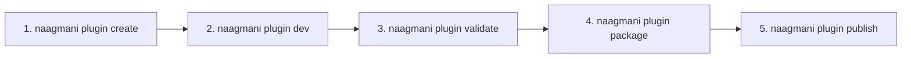

# Plugin Management via CLI

Manage the complete end-to-end lifecycle of custom HDK plugins using the `naagmani plugin` command group.

---

## Workflow Overview



---

## Common Commands

### 1. Create a Plugin
```bash
naagmani plugin create auth-validator --language node
```

### 2. Live Local Development & Hot-Reload
```bash
naagmani plugin dev .
```

### 3. Inspect Plugin Telemetry & Metrics
```bash
naagmani plugin metrics auth-validator
```

---

## Related Documentation

- [Building Plugins with HDK](file:///e:/project/naagmani-project/naagmani-docs/docs/build/hdks/development.md)
- [Command Reference](file:///e:/project/naagmani-project/naagmani-docs/docs/build/cli/commands.md)
