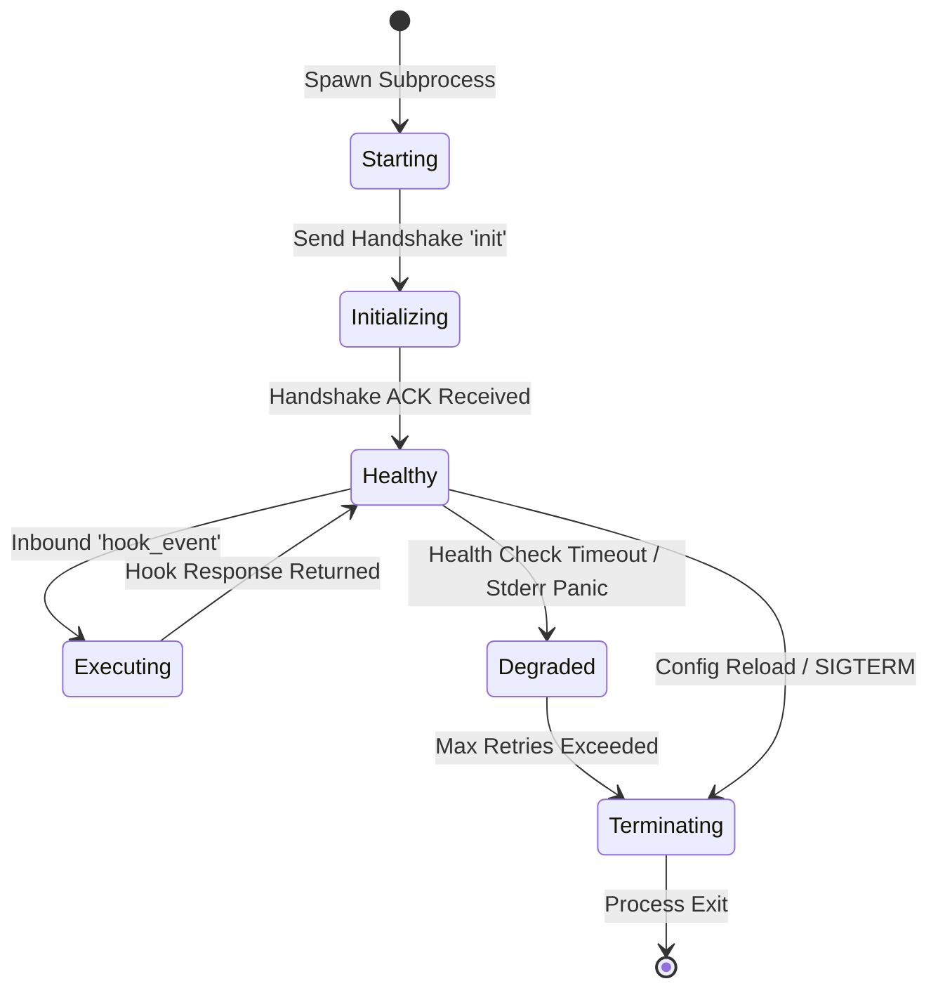
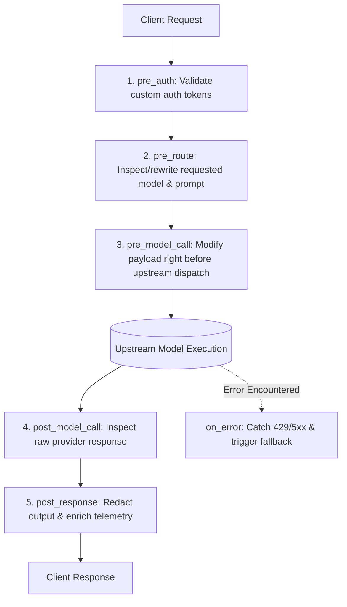

# Plugin Lifecycle & Execution Hooks

Understand the complete lifecycle of an HDK plugin process and the available execution hook phases.

---

## Worker Process Lifecycle

---

## Execution Hook Pipeline

---

## Hook Descriptions

| Hook Name | Execution Point | Primary Use Case |
|---|---|---|
| `pre_route` | Before routing policy resolution. | Prompt injection defense, PII masking, virtual alias rewrites. |
| `pre_model_call`| Immediately prior to upstream HTTP dispatch. | Injecting dynamic system prompts or few-shot examples. |
| `post_model_call`| When raw completion returns from upstream. | Measuring token counts, checking moderation flags. |
| `post_response` | Immediately before returning SSE stream or JSON to client. | DLP masking on output text, watermarking, response enrichment. |
| `on_error` | When an upstream provider returns an error (429/5xx). | Logging diagnostic traces or mutating failover candidates. |

---

## Related Documentation

- [HDK Overview](file:///e:/project/naagmani-project/naagmani-docs/docs/build/hdks/overview.md)
- [Plugin Development Guide](file:///e:/project/naagmani-project/naagmani-docs/docs/build/hdks/development.md)
