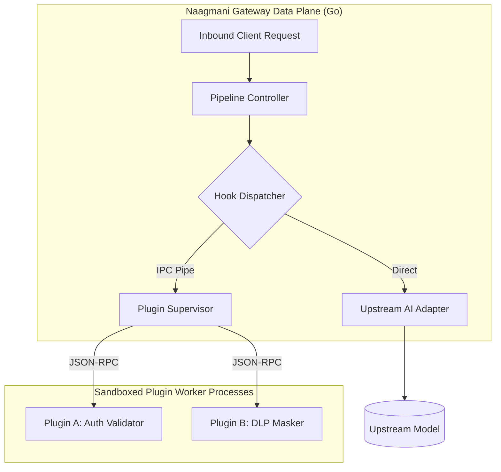

# HDK Overview & Architecture

The **Naagmani Host Development Kit (HDK)** provides the runtime specifications, protocols, and toolkits for building native capability plugins and request interceptors that run inside the Naagmani Gateway Data Plane.

---

## What is an HDK Plugin?

An HDK plugin is an out-of-process, sandboxed worker daemon written in **Go**, **Node.js/TypeScript**, or **Python**. 

The gateway spawns the plugin process upon startup and communicates with it using a high-throughput **JSON-RPC 2.0 wire protocol** over standard I/O pipes (`stdin`/`stdout`) or Unix domain sockets:



---

## Core HDK Capabilities

1. **Pipeline Interception**: Inspect, mutate, or short-circuit requests at `pre_route`, `pre_model_call`, and `post_response` execution phases.
2. **Crash Resilience & Auto-Restart**: If a plugin process panics, the gateway supervisor isolates the failure, logs a diagnostic event, and restarts the worker without dropping active HTTP client connections.
3. **Strict Resource Sandboxing**: Plugins execute with CPU/memory cgroup limits and restricted network access.

---

## The Plugin Structure

Every HDK plugin consists of:
```text
my-plugin/
├── plugin.json         # Manifest defining capabilities, hooks & config schema
├── src/                # Implementation code (Go, Node, Python)
├── Makefile / build.sh # Compilation script producing target binary
└── README.md           # Plugin documentation
```

---

## Next Steps

- Review the [Plugin Manifest Schema (plugin.json)](file:///e:/project/naagmani-project/naagmani-docs/docs/build/hdks/manifest.md)
- Learn about the [Wire Protocol v1](file:///e:/project/naagmani-project/naagmani-docs/docs/build/hdks/protocol.md)
- Follow the step-by-step [Plugin Development Tutorial](file:///e:/project/naagmani-project/naagmani-docs/docs/build/hdks/development.md)
