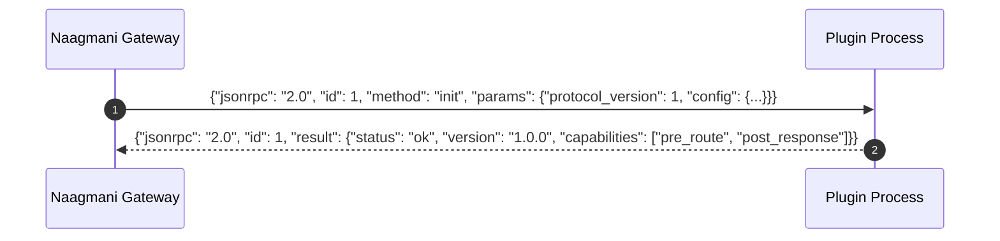

# Wire Protocol v1 & IPC

The **Naagmani Wire Protocol v1** specifies the asynchronous JSON-RPC 2.0 communication format between the gateway process and sandboxed plugin workers.

---

## 1. Handshake & Initialization

When the gateway spawns a plugin worker, it immediately initiates a handshake sequence over `stdin`:



---

## 2. Hook Event Execution

During an active request, the gateway invokes the plugin with the current request context:

### Inbound Hook Event (Gateway -> Plugin)

```json
{
  "jsonrpc": "2.0",
  "id": 42,
  "method": "hook_event",
  "params": {
    "hook": "pre_route",
    "request_id": "req_01J8F0A7B...",
    "organization_id": "org_acme",
    "project_id": "proj_search",
    "model": "smart",
    "messages": [
      { "role": "user", "content": "Process refund for order 12345" }
    ]
  }
}
```

### Hook Response Action (Plugin -> Gateway)

A plugin can respond with three possible actions:
1. **`continue`**: Allow request to proceed (with optional mutated payload).
2. **`short_circuit`**: Immediately return a custom response without calling upstream models.
3. **`reject`**: Block the request with a specific HTTP status code and error message.

```json
{
  "jsonrpc": "2.0",
  "id": 42,
  "result": {
    "action": "continue",
    "mutations": {
      "messages": [
        { "role": "user", "content": "Process refund for order [REDACTED_ORDER_ID]" }
      ]
    }
  }
}
```

---

## Related Documentation

- [Plugin Lifecycle & Hooks](file:///e:/project/naagmani-project/naagmani-docs/docs/build/hdks/lifecycle.md)
- [Plugin Development Tutorial](file:///e:/project/naagmani-project/naagmani-docs/docs/build/hdks/development.md)
