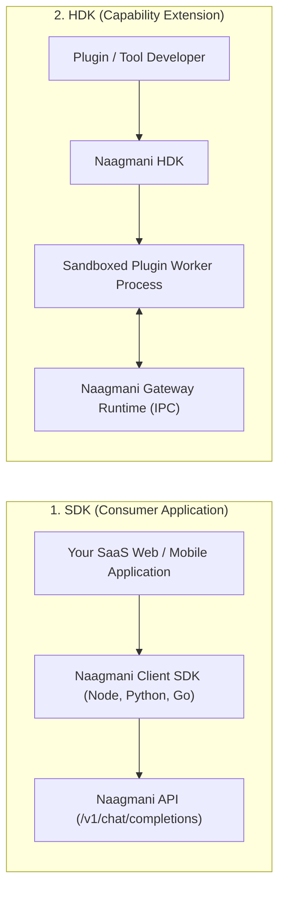

# SDK Overview

Official client libraries for integrating the Naagmani AI Operating System into your frontend and backend applications.

---

## SDK vs HDK: What is the Difference?

It is important to understand the distinct purposes of the **SDK** versus the **HDK**:



- **SDK (Software Development Kit)**: Use this to **consume Naagmani APIs** from your application (send chat prompts, stream tokens, query embeddings, manage project resources).
- **HDK (Host Development Kit)**: Use this to **extend the Naagmani Gateway** by authoring sandboxed native plugins, request/response interceptors, and custom tools.

---

## Available Official SDKs

| Language / Runtime | Package Name | Installation | Guide |
|---|---|---|---|
| **Node.js / TypeScript** | `@naagmani/sdk` | `npm install @naagmani/sdk` | [Node.js SDK](file:///e:/project/naagmani-project/naagmani-docs/docs/build/sdks/node.md) |
| **Python (3.9+)** | `naagmani-sdk` | `pip install naagmani-sdk` | [Python SDK](file:///e:/project/naagmani-project/naagmani-docs/docs/build/sdks/python.md) |
| **Go (1.22+)** | `github.com/bhakha-services/naagmani-sdk-go` | `go get github.com/bhakha-services/naagmani-sdk-go` | [Go SDK](file:///e:/project/naagmani-project/naagmani-docs/docs/build/sdks/go.md) |

---

## Drop-In OpenAI SDK Compatibility

Because Naagmani adheres strictly to OpenAI API specifications, you can also use official OpenAI SDKs directly simply by setting the `baseURL` to your Naagmani gateway:

```typescript
import OpenAI from 'openai';

const client = new OpenAI({
  apiKey: process.env.NAAGMANI_API_KEY,
  baseURL: 'http://localhost:8080/v1',
});
```

---

## Next Steps

- Explore the [Node.js / TypeScript SDK](file:///e:/project/naagmani-project/naagmani-docs/docs/build/sdks/node.md)
- Explore the [Python SDK](file:///e:/project/naagmani-project/naagmani-docs/docs/build/sdks/python.md)
- Explore the [Go SDK](file:///e:/project/naagmani-project/naagmani-docs/docs/build/sdks/go.md)
