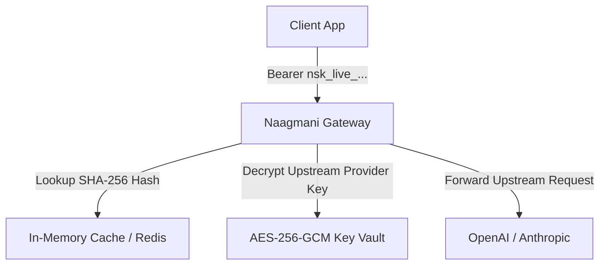

# API Keys & Vault Security

Naagmani uses **API Keys** to authenticate incoming traffic from client applications, SDKs, and backend services to the Gateway Data Plane.

---

## Key Architecture & Vaulting

### 1. Zero Secret Storage
When an API key (`nsk_live_...`) is generated:
- The full key is displayed **once** to the user and never stored in plain text.
- Naagmani computes a cryptographic **SHA-256 hash** of the token for fast database lookup and verification.

### 2. Provider Key Masking
Client applications never need upstream OpenAI, Anthropic, or Gemini API keys. The gateway securely injects the vaulted provider credentials on the fly, eliminating secret leakage risks in frontend builds.

---

## Key Lifecycle Management

- **Create Key**: Generate keys with human-readable names and environment tags.
- **Revoke Key**: Instantly revoke keys from the Developer Portal. Revocation takes effect across all gateway instances in under 1 second.
- **Audit Logging**: Every key creation, modification, and revocation is recorded in the immutable compliance audit log.

---

## Next Steps

- Learn about scoped machine tokens: [Project Service Tokens](project-service-tokens.md)
- Manage keys in the UI: [Developer Portal API Keys](../quickstart/api-key.md)
