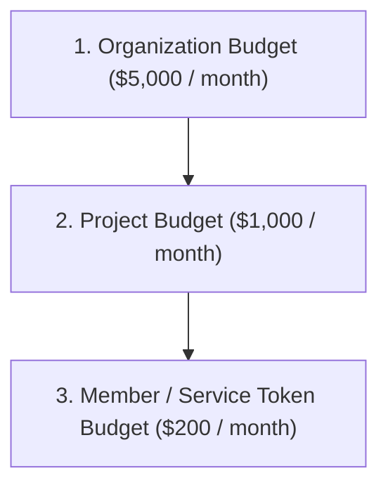

# FinOps & Budget Hierarchy

Naagmani features an authoritative **Hierarchical Budget Engine** that enforces spending controls across your organizational hierarchy.

---

## The 3-Tier Budget Hierarchy

### Hierarchy Rules & Guarantees:
1. **Parent Cap Rule**: A child entity (Member or Project) **cannot** have a budget limit that exceeds its parent (Organization). Setting a Member budget to $30,000 when the Organization budget is $3,000 will be rejected with an immediate `HTTP 400 Bad Request`.
2. **Inheritance Flow**: If a Member or Project has no explicit budget set, workloads automatically inherit the parent Organization budget.
3. **Hard Ceiling Enforcement**: When an entity hits its budget threshold, inference requests are blocked with `HTTP 429 Quota Exceeded`, protecting your company from unexpected provider invoices.

---

## Daily vs Monthly Budget Limits

- **Monthly Budget**: Enforces aggregate limits over the monthly billing calendar.
- **Daily Budget**: Prevents sudden cost spikes from runaway recursive agent loops or load testing.

---

## Next Steps

- Manage budgets in Developer Portal: [FinOps & Budget Controls](../developer-portal/finops-budgets.md)
- Configure member budgets: [Members & Access Control](../developer-portal/members.md)
