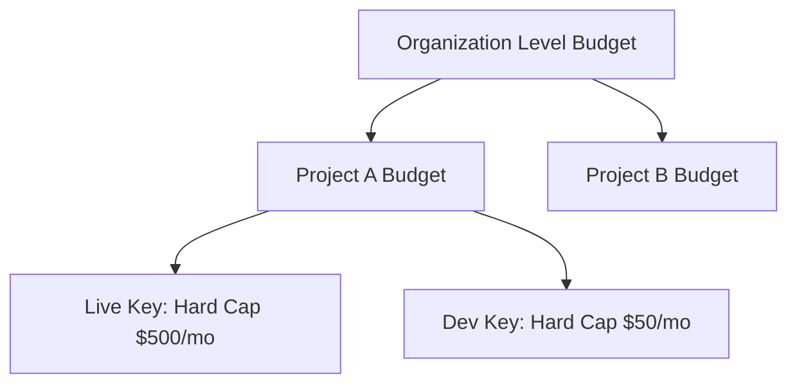

# Billing & Budgets

Naagmani provides centralized cost control, budget alerts, and spend caps across projects, teams, and upstream providers.

---

## Spend Governance

AI application costs can scale unexpectedly without hard controls. Naagmani provides multi-tiered budget enforcement:

---

## Budget Types

| Type | Action Triggered | Description |
| :--- | :--- | :--- |
| **Soft Alert** | Webhook / Email Notification | Sends notification when spending reaches a threshold (e.g., 80% of budget). |
| **Hard Cap** | HTTP 429 (`insufficient_quota`) | Rejects subsequent non-essential requests once the budget limit is reached. |
| **Rate Throttling** | Degraded Tier | Automatically shifts routing policy to economy models (e.g., GPT-4o mini instead of GPT-4o) when spend velocity exceeds target burn rate. |

---

## Cost Calculation Models

1. **BYOK Direct**: When using your own provider keys, Naagmani computes estimated costs based on public provider token pricing tables for reporting and alerting purposes.
2. **Naagmani Managed Credits**: Organizations purchase unified credit pools that draw down per token processed across all providers and active marketplace plugins.

---

## Invoices & Breakdown Reports

Through the Developer Portal, administrators can view:
- Spend grouped by Project, Environment, or API Key.
- Spend grouped by Upstream Provider (OpenAI, Anthropic, Gemini).
- Spend grouped by Model Tier (Smart vs. Fast vs. Embeddings).
- Spend grouped by Plugin executions (e.g., DLP inspection, Vector Search).
- CSV/JSON export for corporate ERP integration.
