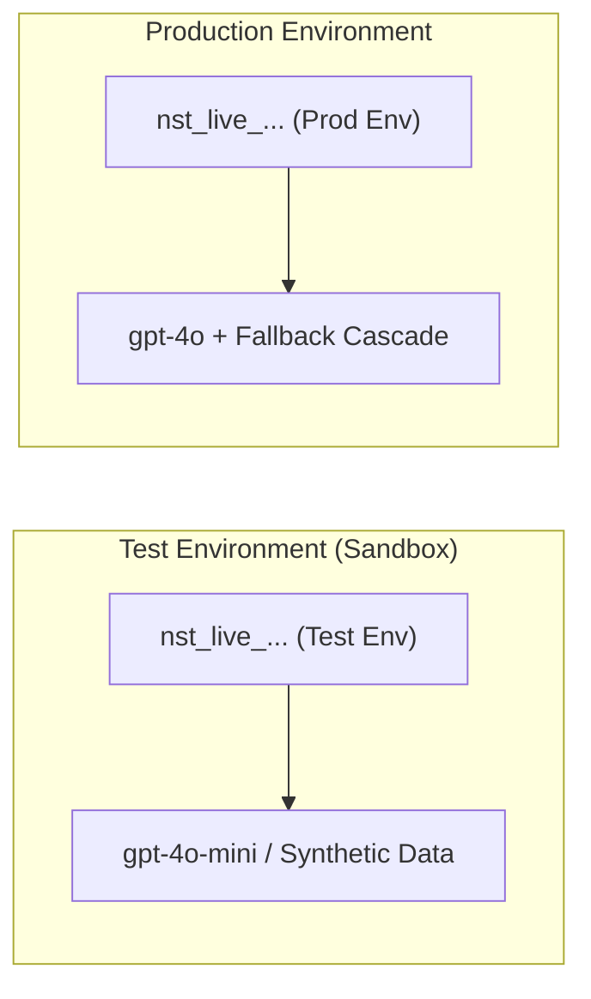

# Environments & Isolation

An **Environment** is an isolated deployment stage within a Project. Naagmani provides native two-tier environment isolation: **Test** and **Production**.

---

## Two-Tier Environment Architecture

Naagmani consolidates workloads into two distinct, cryptographically isolated tiers:

| Environment | Purpose | Credential Scope | Model Strategy |
| :--- | :--- | :--- | :--- |
| **Test** (`test`) | Local development, automated CI pipelines, and pre-release integration tests. | Sandboxed Test Service Tokens | Cost-effective models, mocks, and rate-limited test pools. |
| **Production** (`production`) | Live customer-facing applications and mission-critical production traffic. | Production Service Tokens | High-availability fallback cascades, dedicated credential pools, strict DLP. |

---

## Environment Isolation Guarantees

1. **Secret & Key Isolation**: Service tokens and credentials issued for the `test` environment are strictly rejected in `production`.
2. **Dedicated Routing Rules**: Use inexpensive, fast models in Test while enforcing strict high-availability fallback cascades and circuit breakers in Production.
3. **Telemetry & Quota Tagging**: Usage analytics, provider attempts, and audit logs are partitioned by environment, enabling clear cost segregation between testing and live operations.

---

## Managing Environments in the Developer Portal

- In the Developer Portal, the active environment is selectable from the top navigation and project sidebar.
- When generating **Project Service Tokens** or **API Keys**, you must explicitly bind the token to its target environment (`Test` or `Production`).

---

## Next Steps

- Learn about API keys: [API Keys & Vault](/docs/concepts/api-keys)
- Learn about service tokens: [Project Service Tokens](/docs/concepts/project-service-tokens)
