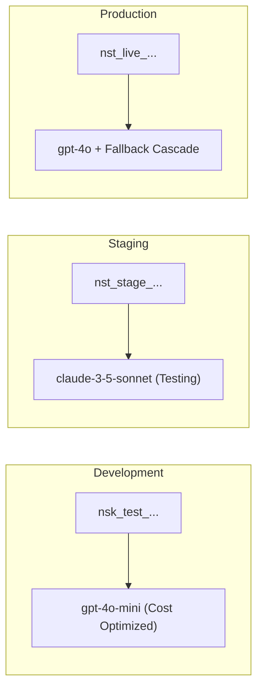

# Environments & Isolation

An **Environment** is a deployment stage within a Project. Naagmani provides native support for multi-stage lifecycle environments (typically `Development`, `Staging`, and `Production`).

---

## Environment Isolation Guarantees

1. **Secret & Key Isolation**: Service tokens issued for `Development` are strictly rejected in `Production`.
2. **Dedicated Routing Rules**: Use inexpensive, fast models in Development while enforcing strict high-availability fallback cascades in Production.
3. **Telemetry & Quota Tagging**: Usage analytics and audit logs are tagged by environment, enabling clean cost breakdown across pre-production and production infrastructure.

---

## Managing Environments

- In the Developer Portal, environments are selectable from the project navigation sidebar.
- When generating **Project Service Tokens** or **API Keys**, you must explicitly bind the credential to its target environment.

---

## Next Steps

- Learn about API keys: [API Keys & Vault](api-keys.md)
- Learn about service tokens: [Project Service Tokens](project-service-tokens.md)
