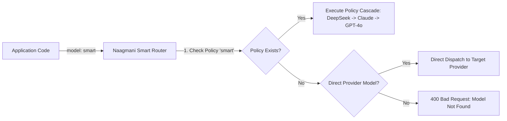

# Models & Virtual Aliases

Naagmani allows engineering teams to decouple application code from specific underlying provider model strings using **Virtual Model Aliases** and **Smart Routing Policies**.



---

## What is a Virtual Model Alias?

Instead of hardcoding concrete strings like `gpt-4o` or `deepseek-chat` across multiple microservices and codebases, your applications request logical aliases defined in your Routing Policies:

```json
{
  "model": "smart",
  "messages": [
    {"role": "user", "content": "Analyze quarterly customer retention trends."}
  ]
}
```

Naagmani intercepts the alias `"smart"`, evaluates the active routing policy for your environment, and dispatches the request to the optimal healthy provider according to the policy rules.

---

## The 3 Model Types Supported in Naagmani

Naagmani strictly accepts 3 types of model identifiers:

| Identifier Type | Example | Behavior |
| :--- | :--- | :--- |
| **Virtual Alias / Policy Name** | `"smart"`, `"fast"`, `"reasoning"`, `"code-gen"` | Strictly resolves against your configured [Routing Policies](../developer-portal/routing-policies.md). Must be explicitly created in the portal. |
| **Automated Router** | `"auto"` | Built-in AI routing engine that evaluates all connected providers and models dynamically. *(Requires Pro/Enterprise license; blocked on free tier)*. |
| **Direct Provider Model** | `"deepseek-chat"`, `"gpt-4o"`, `"claude-3-5-sonnet-20241022"`, `"gemini-2.5-flash"` | Direct dispatch to the specified provider and model registered in your active credential pool. |

> [!NOTE]
> If a requested model does not match an existing Routing Policy, `"auto"`, or a supported provider model in your pool, Naagmani will immediately reject the request with `400 Bad Request: no eligible provider candidate found for model`.

---

## Recommended Alias Naming Patterns

| Alias Name | Purpose | Example Policy Cascade |
| :--- | :--- | :--- |
| **`smart`** / **`smart-tier`** | State-of-the-art reasoning and deep analysis | DeepSeek R1 / V3 $\rightarrow$ Claude 3.5 Sonnet $\rightarrow$ GPT-4o |
| **`fast`** / **`fast-tier`** | Ultra-low-latency real-time interactions | Gemini 2.5 Flash $\rightarrow$ GPT-4o-mini $\rightarrow$ Claude 3.5 Haiku |
| **`cheap`** / **`economy`** | Cost-effective bulk processing | DeepSeek V3 $\rightarrow$ Llama 3.3 70B |
| **`code`** / **`code-gen`** | Code synthesis and review | Claude 3.5 Sonnet $\rightarrow$ DeepSeek Coder |

---

## Key Benefits of Virtual Aliases

1. **Zero-Downtime Model Swaps**: When a new flagship model drops (e.g. GPT-5 or DeepSeek V4), switch your `smart` alias in the Developer Portal without redeploying backend services.
2. **Multi-Provider Resilience**: If an upstream provider suffers an outage or rate-limiting (429), your policy automatically cascades to the configured secondary provider.
3. **Environment Isolation**:
   - **Development/Staging**: Point `smart` to cost-effective models (`deepseek-chat` or `gpt-4o-mini`).
   - **Production**: Point `smart` to flagship models (`claude-3-5-sonnet` or `deepseek-reasoner`).

---

## Next Steps

- **Supported Providers & Model Catalog**: [Model Providers & Adapters](providers.md)
- **Configure Routing Policies**: [Smart Routing Policies](../developer-portal/routing-policies.md)
- **Deep Dive into Routing**: [Smart Model Routing & Fallbacks](routing.md)
- **Interactive Playground**: [Model Playground](../developer-portal/model-playground.md)
