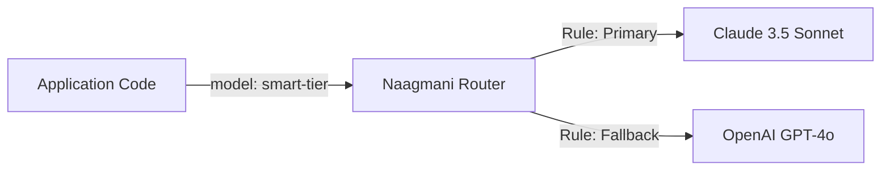

# Models & Virtual Aliases

Naagmani allows engineering teams to decouple application code from specific underlying model strings using **Virtual Model Aliases**.

---

## What is a Virtual Model Alias?

Instead of hardcoding `gpt-4o` or `claude-3-5-sonnet-20241022` into your backend repositories, your applications request virtual tier aliases:

### Common Alias Patterns:
- **`smart-tier`**: Resolves to state-of-the-art reasoning models (e.g., Claude 3.5 Sonnet $\rightarrow$ GPT-4o).
- **`fast-tier`**: Resolves to ultra-low-latency, lightweight models (e.g., Gemini 2.5 Flash $\rightarrow$ GPT-4o-mini).
- **`cheap-tier`**: Resolves to high-throughput, cost-efficient models (e.g., DeepSeek V3).

---

## Benefits of Virtual Aliases

1. **Instant Model Upgrades**: When a new model version is released (e.g. GPT-5), update the alias target in the Developer Portal with zero application downtime or deployments.
2. **Zero Code Refactoring**: Switch primary providers across hundreds of microservices instantly.
3. **Environment-Specific Routing**: Route `smart-tier` to an inexpensive model in Test and the premier flagship model in Production.

---

## Next Steps

- Configure routing rules: [Smart Model Routing](routing.md)
- Test models interactively: [Model Playground](../developer-portal/model-playground.md)
