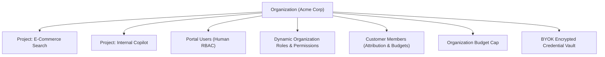

# Organizations & Tenancy

In Naagmani, the **Organization** represents the highest-level entity in the tenant hierarchy. It serves as the administrative, billing, and governance container for an enterprise or development team.

---

## Key Responsibilities of an Organization

1. **Billing & Budget Authority**: Governs the root spending limit for all underlying projects and customer members. Project and Customer Member limits can never exceed the Organization's limit.
2. **Team & Portal User Access**: Manage Developer Portal logins, dynamic role assignments, and organization memberships:
   - **System Roles**: Predefined `Owner`, `Admin`, and `Member` platform roles.
   - **Custom Roles**: Tailored roles (e.g. `Project Operator`, `Billing Manager`) composed of granular canonical permissions.
3. **Customer / Application Directory**: Manage end-user and application member identities for token usage attribution and individual spending limits.
4. **Bring-Your-Own-Key (BYOK) Vault**: Store root provider API keys (OpenAI, Anthropic, Gemini, DeepSeek) centrally with AES-256-GCM encryption.
5. **Audit Trail**: Aggregated compliance logging capturing every authentication event, key creation, role modification, and high-level routing operation.

---

## Managing in the Developer Portal

Organizations can be managed directly in the **Developer Portal**:
- **Switch Organizations**: Use the top-left Organization dropdown selector in the navigation bar.
- **Organization Settings**: Navigate to [{{DEVELOPER_PORTAL_URL}}/organizations]({{DEVELOPER_PORTAL_URL}}/organizations) to update organization name and view subscription tier.
- **Portal Users**: Manage team access and roles at [{{DEVELOPER_PORTAL_URL}}/users]({{DEVELOPER_PORTAL_URL}}/users).
- **Roles & Permissions**: Create and configure custom organization roles at [{{DEVELOPER_PORTAL_URL}}/roles]({{DEVELOPER_PORTAL_URL}}/roles).
- **Customer Members**: Manage customer attribution and spending caps at [{{DEVELOPER_PORTAL_URL}}/members]({{DEVELOPER_PORTAL_URL}}/members).

---

## Next Steps

- Learn about project boundaries: [Projects & Workloads](projects.md)
- Manage portal team members: [Portal Users](../developer-portal/users.md)
- Configure custom roles: [Roles & Permissions](../developer-portal/roles.md)
- Manage customer spending caps: [Customer Members Directory](../developer-portal/members.md)
