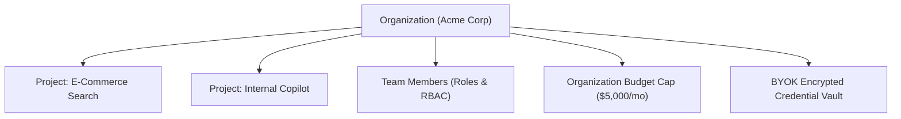

# Organizations & Tenancy

In Naagmani, the **Organization** represents the highest-level entity in the tenant hierarchy. It serves as the administrative, billing, and governance container for an enterprise or development team.

---

## Key Responsibilities of an Organization

1. **Billing & Budget Authority**: Governs the root spending limit for all underlying projects and members. Project and Member limits can never exceed the Organization's limit.
2. **Team & Membership Access**: Manage user accounts with strict Role-Based Access Control (RBAC):
   - **Owner**: Full administrative control, billing ownership, and destructive action permissions.
   - **Admin**: Project creation, member invitations, credential management, and routing policy configuration.
   - **Member**: Access to assigned projects, playgrounds, and issued service tokens.
3. **Bring-Your-Own-Key (BYOK) Vault**: Store root provider API keys (OpenAI, Anthropic, Gemini, DeepSeek) centrally with AES-256-GCM encryption.
4. **Audit Trail**: Aggregated compliance logging capturing every authentication event, key creation, member role change, and high-level routing operation.

---

## Managing in the Developer Portal

Organizations can be managed directly in the **Developer Portal**:
- **Switch Organizations**: Use the top-left Organization dropdown selector in the navigation bar.
- **Organization Settings**: Navigate to [http://localhost:3000/settings](http://localhost:3000/settings) to update organization name, billing details, and view subscription tier.
- **Members Directory**: Manage engineers and permissions at [http://localhost:3000/members](http://localhost:3000/members).

---

## Next Steps

- Learn about project boundaries: [Projects & Workloads](projects.md)
- Configure team members: [Members & Access Control](../developer-portal/members.md)
