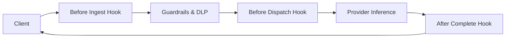

# Plugin System & Lifecycle

Naagmani's plugin engine allows developers to intercept, modify, and guard AI requests using an out-of-process, language-independent architecture (`naagmani.plugin/v1`).

---

## Key Capabilities

1. **Multi-Language SDKs**: Author plugins in **Go**, **TypeScript/Node.js**, or **Python**.
2. **Isolated Sandboxing**: Plugins run in isolated worker processes, ensuring custom code cannot crash the core gateway engine.
3. **Execution Hooks**:
   - `before_ingest`: Inspect incoming headers, validate custom tokens.
   - `before_dispatch`: Mask sensitive PII/DLP data, inject system context, RAG vector retrieval.
   - `after_complete`: Sanitize model responses, log analytics, trigger downstream webhooks.

---

## Next Steps

- Deep dive into plugin development: [Plugin Development Guide](../plugins/overview.md)
- Plugin manifest specification: [Plugin Manifest](../plugins/manifest.md)
