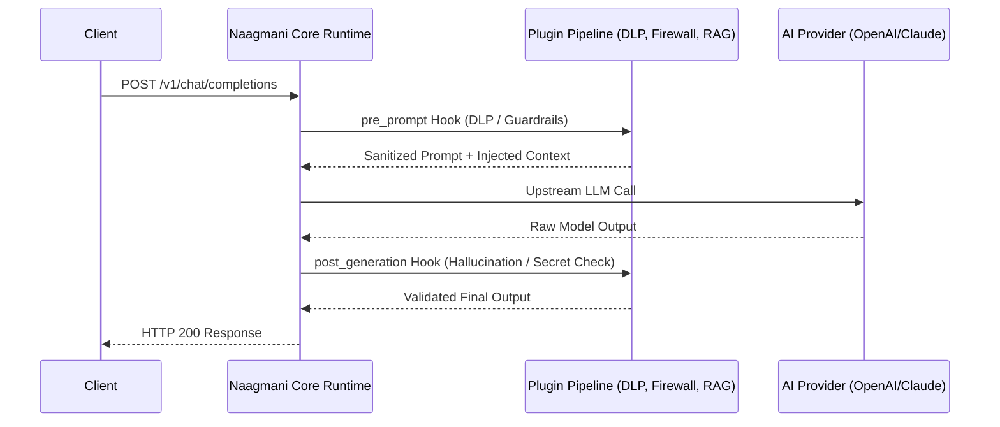

# Plugins Architecture Overview

Plugins in Naagmani are modular extensions that intercept, augment, secure, or monitor the AI request/response lifecycle.

---

## Why Plugins?

In traditional AI applications, developers manually implement security guards, retrieval augmentations, redactions, logging, and tool calling within custom application code.

Naagmani moves these cross-cutting capabilities into an isolated, composable **Plugin Pipeline**:

---

## Key Characteristics

1. **Protocol Standard (`naagmani.plugin/v1`)**: All plugins communicate with the Naagmani Runtime over standard JSON-RPC 2.0 via standard I/O (`stdio`).
2. **Language Agnostic**: Plugins can be written in any language. Official HDKs exist for **Go**, **Node.js/TypeScript**, and **Python**.
3. **Isolated Execution**: Plugins run in isolated sub-processes with explicit capability permissions declared in a `plugin.json` manifest.
4. **Zero-Overhead Local IPC**: Communication between the Naagmani runtime and plugin processes is optimized for low latency (< 2ms typical IPC overhead).
5. **Chainable Execution**: Multiple plugins can be combined into an execution pipeline with deterministic order and error handling policies.

---

## Plugin Types

| Type | Common Use Cases |
| :--- | :--- |
| **Security & Guardrails** | Prompt injection defense, PII/secret masking (DLP), toxic content moderation. |
| **Data & Retrieval** | Knowledge base retrieval (RAG), dynamic context injection, memory retrieval. |
| **Tool Calling & MCP** | Model Context Protocol (MCP) server bridging, database query tools, API orchestration. |
| **Observability & Auditing** | Regulatory compliance archiving, custom vector analytics, user feedback logging. |

For detailed protocol specifications and SDK development guides, see the [Plugins Documentation](../plugins/overview.md).
