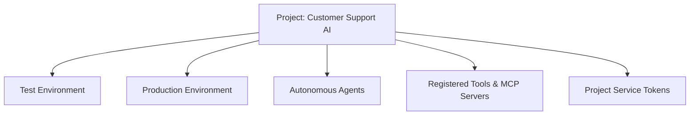

# Projects & Workloads

A **Project** is an isolated workspace within an Organization dedicated to a specific application, microservice, or AI initiative.

---

## Why Use Projects?

Projects enforce strict resource and credential isolation between different workloads:
- **Credential Segregation**: API Keys and Service Tokens created in *Project A* cannot access models or resources in *Project B*.
- **Autonomous Agents**: Agents, prompt templates, skills, and MCP tools are scoped to the project.
- **Budget Allocation**: Assign specific monthly budgets to individual projects to prevent runaway costs from affecting other teams.

---

## Project Structure

Every Project contains:
- **Environments**: Two-tier isolation stages (`Test` and `Production`).
- **Service Tokens**: Machine-to-machine credentials scoped to the project and environment.
- **Routing Policies**: Custom fallback cascades and latency/cost optimization rules.
- **Agent Ecosystem**: Autonomous agents, tools, skills, and MCP server integrations.

---

## Managing in the Developer Portal

1. Navigate to the **Projects** list at [http://localhost:3000/projects](http://localhost:3000/projects).
2. Click **+ Create Project** to initialize a new workspace.
3. Select any project to view its dedicated dashboard, service tokens, agents, and analytics.

---

## Next Steps

- Understand environment boundaries: [Environments & Isolation](/docs/concepts/environments)
- Issue project credentials: [Project Service Tokens](/docs/concepts/project-service-tokens)
