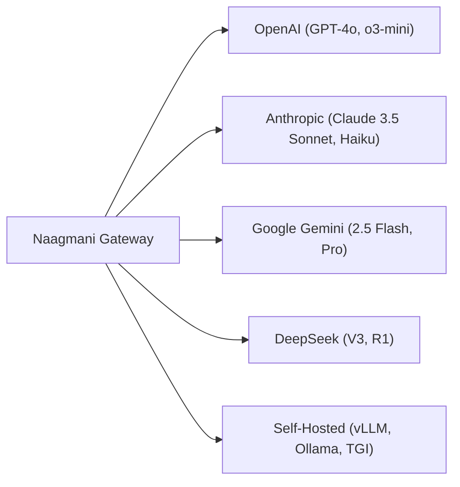

# Model Providers & Adapters

Naagmani provides native adapters for all leading commercial model providers as well as self-hosted open-source inference runtimes.

---

## Supported Providers

| Provider | Supported Models | Protocol Capabilities |
| :--- | :--- | :--- |
| **OpenAI** | `gpt-4o`, `gpt-4o-mini`, `o1`, `o3-mini`, `text-embedding-3-small` | Chat, Streaming SSE, Tool Calling, Vision, JSON Schema |
| **Anthropic** | `claude-3-5-sonnet-20241022`, `claude-3-5-haiku-20241022`, `claude-3-opus` | Chat, Streaming SSE, Tool Calling, Vision |
| **Google Gemini** | `gemini-2.5-flash`, `gemini-2.5-pro`, `gemini-1.5-flash` | Chat, Streaming SSE, Tool Calling, Multimodal |
| **DeepSeek** | `deepseek-chat` (V3), `deepseek-reasoner` (R1) | Chat, Reasoning Streams, Low Cost Inference |
| **Self-Hosted** | Any HuggingFace model hosted via **vLLM**, **Ollama**, or **TGI** | OpenAI-compatible endpoint translation |

---

## Universal Protocol Normalization

Every provider utilizes different parameter formats, role definitions, and error schemas. Naagmani's gateway engine normalizes:
- Message roles (`system`, `user`, `assistant`, `tool`).
- Function and tool call schemas.
- Server-Sent Events (SSE) delta structures.
- Upstream HTTP error codes and overload responses.

---

## Next Steps

- Learn about model aliases: [Models & Virtual Aliases](models.md)
- Configure provider keys: [BYOK & Credential Pools](../developer-portal/credential-pools.md)
