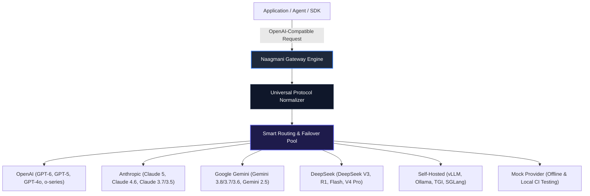

# Model Providers & Adapters

Naagmani AI OS provides native, production-grade adapters for all major commercial model providers as well as self-hosted open-source inference runtimes. Every provider is unified under Naagmani's universal protocol normalization layer with zero-latency streaming, automatic health probing, failover cascade, and BYOK (Bring Your Own Key) credential management.



---

## Supported Providers Overview

| Provider | Canonical ID | Auth Method | Base URL Environment Override | Health Probe Endpoint |
| :--- | :--- | :--- | :--- | :--- |
| **OpenAI** | `openai` | Bearer API Key (`sk-...`) | `NAAGMANI_OPENAI_BASE_URL` | `GET /v1/models` |
| **Anthropic** | `anthropic` (or `claude`) | `x-api-key` header | `NAAGMANI_ANTHROPIC_BASE_URL` | `GET /v1/models` |
| **Google Gemini** | `google` (or `gemini`) | `x-goog-api-key` header / param | `NAAGMANI_GEMINI_BASE_URL` | `GET /v1beta/models` |
| **DeepSeek** | `deepseek` | Bearer API Key (`sk-...`) | `NAAGMANI_DEEPSEEK_BASE_URL` | `GET /user/balance` |
| **Self-Hosted** | `openai` / custom | Bearer Token / Custom header | Custom Endpoint URL | `GET /v1/models` |
| **Mock Provider** | `mock` | None (Local In-Memory) | N/A | Local deterministic ping |

> [!NOTE]
> Canonical IDs are case-insensitive. Aliases like `"gemini"` and `"google"`, or `"claude"` and `"anthropic"` are automatically resolved to their authoritative platform adapter.

---

## Complete Model Catalog by Provider

### 1. OpenAI (`openai`)

Naagmani supports the complete catalog of OpenAI models including next-generation reasoning engines, multi-modal vision systems, code generation models, and real-time audio transformers.

#### Frontier & Reasoning Models
| Model ID | Context Window | Capabilities | Description & Recommended Use Cases |
| :--- | :--- | :--- | :--- |
| **`gpt-6-astra`** | 1,050,000 | Chat, Vision, Tools, Structured Outputs | OpenAI flagship model built for complex multi-step reasoning, agentic coding, computer use, and autonomous research. |
| **`gpt-5.6-sol`** | 1,050,000 | Chat, Vision, Tools, Structured Outputs | Flagship model for complex professional work with configurable reasoning effort. |
| **`gpt-5.6-terra`** | 1,050,000 | Chat, Vision, Tools, Structured Outputs | Balances frontier intelligence with latency and cost efficiency. |
| **`gpt-5.6-luna`** | 1,050,000 | Chat, Vision, Tools, Structured Outputs | Optimized for high-throughput, latency-critical, and cost-sensitive workloads. |
| **`gpt-5.6-cyber`** | 1,050,000 | Chat, Tools, Structured Outputs | Specialized cybersecurity model for authorized vulnerability research and defensive analysis. |
| **`gpt-5.5`** / **`gpt-5.5-pro`** | 1,050,000 | Chat, Vision, Tools, Structured Outputs | High-precision class for agentic coding and professional workflows. |
| **`gpt-5.4`** / **`gpt-5.4-mini`** / **`gpt-5.4-nano`** | 1,050,000 | Chat, Vision, Tools, Structured Outputs | High-performance reasoning suite spanning ultra-fast nano agents to full-scale coding engines. |
| **`gpt-5.3-codex`** | 1,050,000 | Chat, Tools, Structured Outputs | Specialized autonomous agentic programming and repository-scale refactoring. |
| **`gpt-5.2`** / **`gpt-5.2-pro`** / **`gpt-5.1`** | 1,050,000 | Chat, Vision, Tools, Structured Outputs | Enterprise reasoning models with adaptive thinking tokens. |
| **`o3-mini`** | 200,000 | Chat, Tools, Structured Outputs, Reasoning | Ultra-fast STEM and code reasoning model with customizable reasoning effort tiers (`low`, `medium`, `high`). |
| **`o1`** | 200,000 | Chat, Vision, Tools, Structured Outputs, Reasoning | Deep reasoning model designed for complex science, math, and architectural logic. |
| **`o4-mini`** | 200,000 | Chat, Tools, Structured Outputs, Reasoning | Lightweight reasoning engine optimized for rapid subagent execution. |

#### Flagship & High-Throughput Models
| Model ID | Context Window | Capabilities | Description & Recommended Use Cases |
| :--- | :--- | :--- | :--- |
| **`gpt-4o`** | 128,000 | Chat, Vision, Tools, Structured Outputs, Multimodal | Fast, intelligent, and versatile multimodal flagship model. Default recommended model for OpenAI. |
| **`gpt-4o-mini`** | 128,000 | Chat, Vision, Tools, Structured Outputs | Affordable small model for high-frequency lightweight tasks, classification, and summarization. |
| **`gpt-4.1`** | 1,047,576 | Chat, Vision, Tools, Structured Outputs | Smartest non-reasoning model featuring a 1M token context window. |
| **`gpt-4.1-mini`** | 1,047,576 | Chat, Vision, Tools, Structured Outputs | High-speed, cost-efficient 1M token context window model. |
| **`chat-latest`** | 128,000 | Chat, Vision, Tools, Structured Outputs | Dynamic alias tracking the latest instant model in ChatGPT. |

#### Embeddings, Audio, Image & Open-Weight
| Model ID | Context Window / Dims | Type | Description |
| :--- | :--- | :--- | :--- |
| **`text-embedding-3-small`** | 8,191 (1536 dims) | Embedding | Highly efficient third-generation text embedding model used by Naagmani's native memory formation worker. |
| **`text-embedding-3-large`** | 8,191 (3072 dims) | Embedding | Highest-performing dense text embedding model for deep semantic retrieval and RAG. |
| **`gpt-image-2`** | N/A | Image Generation | State-of-the-art multimodal diffusion and generation engine. |
| **`gpt-realtime-2.1`** | 128,000 | Realtime Audio | Low-latency voice and reasoning model for interactive conversational agents. |
| **`gpt-audio-1.5`** | 128,000 | Audio In/Out | Premier voice model for audio in, audio out with chat completions. |
| **`gpt-transcribe`** | 128,000 | Speech-to-Text | High-accuracy transcription model for audio files and real-time feeds. |
| **`omni-moderation-latest`**| 32,768 | Moderation | Multimodal moderation for text and image safety checks. |
| **`gpt-oss-120b`** | 131,072 | Open-Weight | OpenAI's flagship open-weight weights model. |
| **`gpt-oss-20b`** | 131,072 | Open-Weight | Low-latency open-weight model for local deployment. |

---

### 2. Anthropic (`anthropic`)

Naagmani provides full support for Anthropic's Claude family, including extended thinking tokens, prompt caching, computer use, and native tool execution.

#### Claude 5 & 4 Series
| Model ID | Context Window | Capabilities | Description & Recommended Use Cases |
| :--- | :--- | :--- | :--- |
| **`claude-fable-5-1`** | 1,000,000 | Chat, Vision, Tools, Structured Outputs | Flagship model for demanding reasoning and long-horizon agentic workflows. |
| **`claude-opus-5`** | 1,000,000 | Chat, Vision, Tools, Structured Outputs | Most capable model for agentic coding, deep logical synthesis, and enterprise systems design. |
| **`claude-sonnet-5`** | 1,000,000 | Chat, Vision, Tools, Structured Outputs | State-of-the-art balance of rapid throughput, deep intelligence, and adaptive thinking. |
| **`claude-opus-4-6`** | 1,000,000 | Chat, Vision, Tools, Structured Outputs | Advanced 1M-context model for high-complexity code generation and multi-file analysis. |
| **`claude-sonnet-4-6`** | 1,000,000 | Chat, Vision, Tools, Structured Outputs | High-throughput reasoning and data analysis engine with 1M context. |
| **`claude-haiku-4-5`** | 200,000 | Chat, Vision, Tools, Structured Outputs | Fastest, cost-efficient model for high-volume automated operations. |

#### Claude 3.7 & 3.5 Series
| Model ID | Context Window | Capabilities | Description & Recommended Use Cases |
| :--- | :--- | :--- | :--- |
| **`claude-3-7-sonnet`** | 200,000 | Chat, Vision, Tools, Extended Thinking | Hybrid model combining instantaneous responses with deep chain-of-thought reasoning. |
| **`claude-3-5-sonnet-20241022`** | 200,000 | Chat, Vision, Tools, Computer Use | Industry benchmark for coding and complex tool execution. |
| **`claude-3-5-haiku-20241022`** | 200,000 | Chat, Vision, Tools | Ultra-fast, responsive model matching previous flagship Claude 3 Opus performance at a fraction of the cost. |
| **`claude-3-opus-20240229`** | 200,000 | Chat, Vision, Tools | Claude 3 frontier model for open-ended synthesis and complex analysis. |

---

### 3. Google Gemini (`google`)

Naagmani integrates with Google's Gemini models using native multimodal streaming, native tool schemas, and million-token context architectures.

| Model ID | Context Window | Capabilities | Description & Recommended Use Cases |
| :--- | :--- | :--- | :--- |
| **`gemini-3.8-flash`** | 1,048,576 | Chat, Vision, Tools, Structured Outputs | Flagship hybrid reasoning model optimized for agentic execution, code generation, and complex workflows. |
| **`gemini-3.7-flash`** | 1,048,576 | Chat, Vision, Tools, Structured Outputs | Natively multimodal reasoning model combining rapid response latency with step-by-step thinking. |
| **`gemini-3.6-flash`** | 1,048,576 | Chat, Vision, Tools, Structured Outputs | Optimized for agentic execution and fast structured JSON generation. |
| **`gemini-3.5-flash`** | 1,048,576 | Chat, Vision, Tools, Structured Outputs | Frontier intelligence for high-throughput multi-step agent workflows. |
| **`gemini-3.5-flash-lite`**| 1,048,576 | Chat, Vision, Tools, Structured Outputs | Cost-effective model for mass extraction and categorization. |
| **`gemini-3.1-pro-preview`**| 1,048,576 | Chat, Vision, Tools, Structured Outputs | Deep multi-step reasoning and precise tool execution preview model. |
| **`gemini-2.5-pro`** | 1,048,576 | Chat, Vision, Tools, Multimodal | Flagship reasoning and multimodal comprehension model. |
| **`gemini-2.5-flash`** | 1,048,576 | Chat, Vision, Tools, Multimodal | High-speed, high-volume production model for audio, video, and text analysis. |
| **`gemini-2.0-flash`** | 1,048,576 | Chat, Vision, Tools, Multimodal | Next-generation fast model with real-time streaming capabilities. |
| **`gemini-1.5-pro`** | 1,048,576 | Chat, Vision, Tools, Multimodal | Long-context document and video analysis model. |
| **`gemini-1.5-flash`** | 1,048,576 | Chat, Vision, Tools, Multimodal | Lightweight, fast model for high-frequency operations. |

---

### 4. DeepSeek (`deepseek`)

Naagmani offers first-class integration with DeepSeek inference endpoints with automatic model alias rewriting (`mapDeepSeekModel`), thinking tokens passthrough, and native live balance probing (`GET /user/balance`).

| Model ID | Context Window | Capabilities | Description & Recommended Use Cases |
| :--- | :--- | :--- | :--- |
| **`deepseek-chat`** (V3) | 128,000 | Chat, Tools, Streaming | State-of-the-art general language model delivering exceptional performance at industry-disrupting low cost. |
| **`deepseek-reasoner`** (R1) | 128,000 | Chat, Reasoning Streams, Thinking | Deep reinforcement learning reasoning model outputting native chain-of-thought `<think>` blocks before delivering answers. |
| **`deepseek-flash`** | 1,000,000 | Chat, Tools, Thinking Mode | High-speed 1M-context model with thinking mode support. Default recommended model for DeepSeek. |
| **`deepseek-v4-pro`** | 1,000,000 | Chat, Tools, Structured Outputs | Flagship model engineered for deep logical reasoning and agentic programming. |

> [!TIP]
> Requests specifying model aliases containing `"reasoner"` or `"r1"` are automatically routed to `deepseek-reasoner`. All other DeepSeek chat requests default to `deepseek-chat` or `deepseek-flash`.

---

### 5. Self-Hosted & Open-Source Gateways

Any OpenAI-compatible inference engine can be registered in Naagmani OS as an active provider. This enables teams to route sensitive data through on-premise hardware or private cloud GPUs.

Supported inference servers:
- **vLLM**: Production-grade high-throughput PagedAttention inference server.
- **Ollama**: Lightweight local model runner for workstations and dev environments.
- **TGI (Text Generation Inference)**: HuggingFace's enterprise serving framework.
- **SGLang / LocalAI / LM Studio**: Specialized high-concurrency runtimes.

Popular open-source models verified with Naagmani:
- **Llama 3.3 (70B, 8B)**
- **Qwen 2.5 (Coder 32B/72B, 7B)**
- **DeepSeek-R1-Distill-Llama / Qwen**
- **Mistral Large 2 / Mixtral 8x22B**
- **Gemma 2 (27B, 9B)**
- **Phi-4 (14B)**

---

### 6. Mock Development Provider (`mock`)

For local offline development, CI/CD automated test suites, and unit testing:
- **ID**: `mock`
- **Behavior**: Deterministic, zero-cost, zero-network responses.
- **Default Models**: `mock-model`, `mock-chat`, `mock-embedding`.
- **Latency Simulation**: Simulates configurable network latency without consuming token budgets.

---

## Universal Protocol Normalization

Every AI provider exposes disparate request parameters, role nomenclature, authentication headers, and error formats. Naagmani's engine transparently standardizes all upstream traffic:

```
[Client Request: OpenAI Standard JSON]
                 │
                 ▼
  [Naagmani Universal Protocol Normalizer]
  ├── Role Translation (system, user, assistant, tool)
  ├── Tool/Function Call Schema Translation
  ├── Streaming SSE Delta Standardizer
  ├── Token Usage Accounting
  └── Upstream Error Categorization & Status Code Mapping
                 │
                 ▼
[Upstream Provider: OpenAI / Anthropic / Google / DeepSeek / vLLM]
```

### Key Normalization Features
1. **Roles & Schemas**: Translates between OpenAI's `messages` array, Anthropic's `system` top-level parameter + `messages`, and Google Gemini's `contents` structure.
2. **Tool / Function Calling**: Unifies OpenAI's `tools[].function` schema with Claude's `tools[].input_schema` and Gemini's `functionDeclarations`.
3. **Streaming & Server-Sent Events**: Converts Anthropic's `content_block_delta` and Gemini's chunks into standard OpenAI SSE `data: {"choices":[{"delta":{"content":"..."}}]}` stream events.
4. **Error Handling**: Standardizes error responses into predictable Naagmani error schemas (`CategoryAuthenticationError`, `CategoryRateLimited`, `CategoryTimeout`, etc.) with sanitized error bodies.

---

## Proactive Health Probing & Auto-Failover

Naagmani OS continuously monitors provider availability via background health probing:

- **Periodic Execution**: Runs every 60 seconds (configurable via `SchedulerConfig`).
- **Zero-Token Footprint**: Probes utilize metadata or balance endpoints (`/models` or `/user/balance`) to prevent consuming billing quotas.
- **Dynamic Credential Sync**: Automatically selects and rotates active BYOK credentials from PostgreSQL. If a credential fails authentication, the scheduler automatically falls back to secondary active keys.
- **Observability**: Live latency metrics, probe success rates, and degradation status are reported directly to the Developer Portal `/providers` dashboard.

---

## Next Steps

- **Configure Provider Credentials**: [BYOK & Credential Pools](../developer-portal/credential-pools.md)
- **Virtual Aliases & Smart Routing**: [Models & Virtual Aliases](models.md)
- **Routing Policies**: [Smart Routing Policies](../developer-portal/routing-policies.md)
- **Test in Model Playground**: [Interactive Playground](../developer-portal/model-playground.md)
