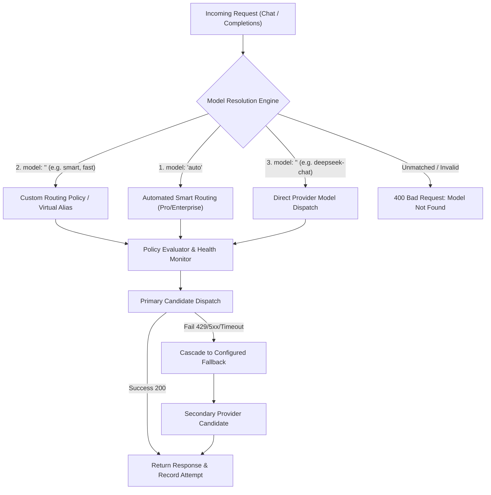

# Smart Model Routing & Fallbacks

Naagmani's **Smart Model Router** is an enterprise-grade execution engine that sits between your client applications and upstream AI providers (OpenAI, Anthropic, DeepSeek, Google, etc.). It resolves model requests, enforces health and circuit breakers, optimizes latency/costs, and handles resilient fallback cascades according to your defined routing policies.



---

## The 3 Model Resolution Modes

When your application sends a completion request (e.g. `POST /v1/chat/completions`), Naagmani strictly checks 3 execution paths. If a model identifier does not match one of these 3, the request is rejected with `400 Bad Request`.

### 1. Built-in Automated Router (`model: "auto"`)
* **What it is**: Naagmani's automated cross-provider multi-model engine.
* **How it works**: Evaluates all active providers in your credential pool and selects the optimal model dynamically based on real-time availability, latency, and token cost.
* **Entitlement**: Automated multi-provider routing is an advanced feature that requires a paid routing entitlement. On the Free tier, requests with `"model": "auto"` return `403 Forbidden` (`automated routing feature requires a paid license`).

### 2. Custom Routing Policies / Virtual Aliases (`model: "<policy_name>"`)
* **What it is**: User-defined routing rules created in the Developer Portal under **Projects > Routing Policies** (e.g., named `smart`, `fast`, `code-eval`, or `production-flagship`).
* **How it works**: When a request specifies `"model": "smart"`, Naagmani looks up the policy named `smart` in the active environment. It strictly executes the configured strategy (Priority Cascade, Lowest Cost, Lowest Latency, or Weighted Traffic Split) and dispatches to the policy's defined candidates.

### 3. Direct Concrete Provider Model (`model: "<provider-model>"`)
* **What it is**: Directly targeting a specific provider's supported model (e.g., `deepseek-chat`, `deepseek-reasoner`, `gpt-4o`, `claude-3-5-sonnet-20241022`, `gemini-2.5-flash`, or provider-scoped `deepseek/deepseek-chat`).
* **How it works**: Naagmani checks the registered model catalog for matching provider credentials in your pool and dispatches directly to that provider's native endpoint.

> [!IMPORTANT]
> **Strict Validation**: Naagmani does **not** blindly route unknown model names to random providers. If you request a model name (such as `"smart"`) without creating a corresponding Routing Policy in the portal, Naagmani will return `400 Bad Request: no eligible provider candidate found for model "smart"`.

---

## Routing Strategies & How They Work

When configuring a Routing Policy in the Developer Portal, you can select among 6 routing strategies. They are evaluated and dispatched by Naagmani OS as follows:

| # | Strategy | Identifier | Selection & Execution Behavior | Ideal Use Case & Rationale |
| :-: | :--- | :--- | :--- | :--- |
| 1 | **Default** | `default` | **Deterministic single-provider execution.** Dispatches directly to the primary candidate without dynamic scoring or weight distribution. | Simple baseline routing when single-model predictability is required. |
| 2 | **Priority** | `priority` | **Ordered tier hierarchy ($1 \rightarrow 2 \rightarrow 3...$).** Candidate #1 is always attempted first. If Candidate #1 fails (HTTP 429 rate limit, 5xx server error, or timeout), it automatically cascades to Candidate #2, then Candidate #3. | Mission-critical workloads requiring flagship model quality with high-availability fallback. |
| 3 | **Failover** | `failover` | **Active-passive failover.** The primary candidate serves 100% of production traffic until marked unhealthy or unresponsive, at which point passive standby candidates take over. | High-reliability setups where a secondary backup provider should only be invoked during outages. |
| 4 | **Weighted** | `weighted` | **Proportional traffic splitting.** Distributes incoming requests across multiple candidates based on assigned weight ratios (e.g. 80% to DeepSeek V4, 20% to Claude 3.5 Sonnet). | A/B testing new models, canary rollouts, or balancing quota across multiple provider keys. |
| 5 | **Lowest Cost** | `lowest_cost` | **Real-time $/1M token pricing optimization.** Dynamically calculates input and output token pricing across all healthy candidates and selects the cheapest active candidate. | High-volume batch transformations, log summarization, data extraction, and cost-sensitive tasks. |
| 6 | **Lowest Latency** | `lowest_latency` | **Fastest TTFT and response time routing.** Measures rolling Time-To-First-Token (TTFT) and connection response latency from background health probes, dispatching to the fastest candidate. | Real-time chat, voice streaming, autocomplete, and low-latency interactive applications. |

---

## Priority Order & Candidate Selection Flow

In **Priority Routing**:
1. **Candidate Row Order**: Each candidate assigned to a policy has an explicit `Priority` index (`1`, `2`, `3`, etc.).
2. **Health Check Filter**: Before dispatching, Naagmani's background health monitor verifies that the candidate's provider is reachable and active.
3. **Primary Dispatch**: The candidate with `Priority: 1` is evaluated first.
4. **Transparent Response Model**: The returned `model` in the completion response matches the exact candidate model that processed the turn (e.g. `"model": "deepseek-v4-pro"`).
5. **Failover Execution**: If the primary candidate encounters a rate limit (HTTP 429) or upstream server outage, Naagmani seamlessly retries with Candidate #2 without failing the client request.

---

## Request Examples

### Example 1: Using a Configured Routing Policy (`smart`)
```bash
# Requires creating a policy named "smart" in Projects > Routing Policies
curl -X POST https://api.naagmani.com/v1/chat/completions \
  -H "Content-Type: application/json" \
  -H "Authorization: Bearer nsk_live_..." \
  -d '{
    "model": "smart",
    "messages": [
      {"role": "system", "content": "You are a helpful assistant."},
      {"role": "user", "content": "Explain quantum computing in simple terms."}
    ],
    "temperature": 0.7
  }'
```

### Example 2: Using Automated Multi-Model Routing (`auto`)
```bash
curl -X POST https://api.naagmani.com/v1/chat/completions \
  -H "Content-Type: application/json" \
  -H "Authorization: Bearer nsk_live_..." \
  -d '{
    "model": "auto",
    "messages": [
      {"role": "user", "content": "Summarize the latest financial report."}
    ]
  }'
```

### Example 3: Direct Specific Provider Model (`deepseek-chat`)
```bash
curl -X POST https://api.naagmani.com/v1/chat/completions \
  -H "Content-Type: application/json" \
  -H "Authorization: Bearer nsk_live_..." \
  -d '{
    "model": "deepseek-chat",
    "messages": [
      {"role": "user", "content": "Write a python function to parse JSON."}
    ]
  }'
```

---

## Circuit Breakers & Observability

Every attempt and failover is recorded with high precision:

1. **Automatic Failover Triggers**:
   - HTTP Status `429` (Rate Limited)
   - HTTP Status `500`, `502`, `503`, `504` (Upstream Server Errors)
   - Upstream Timeouts (configured per-candidate timeout threshold)
   - Stream connection interrupts

2. **Circuit Breakers**:
   - When a provider fails 5 consecutive times within a rolling window, the circuit trips to `OPEN`.
   - Traffic is temporarily diverted away from that provider for a cooldown period (e.g. 60 seconds).
   - Background health probes automatically verify provider recovery before restoring production traffic.

3. **Provider Attempt Accounting**:
   - Every single attempt (initial attempt `Idx #0`, retries `Idx #1`, `Idx #2`) is recorded in the [Provider Attempt Accounting](/docs/developer-portal/attempts.md) dashboard.
   - You can inspect exact TTFT, adapter latency, provider request IDs, error codes, and estimated COGS costs for every cascade execution.

---

## Next Steps

- **Create Routing Policies**: Follow the [Routing Policies Portal Guide](../developer-portal/routing-policies.md).
- **Inspect Execution Logs**: Review [Provider Attempt Accounting](../developer-portal/attempts.md).
- **Manage Model Aliases**: See [Models & Virtual Aliases](models.md).
