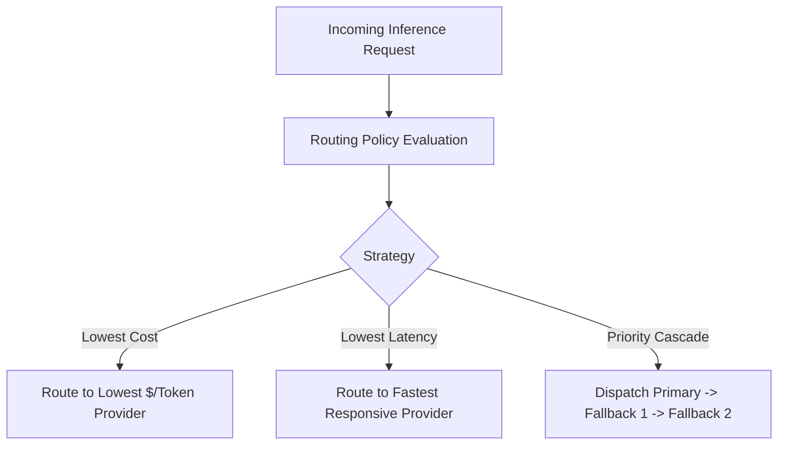

# Smart Model Routing & Fallbacks

Naagmani's **Smart Model Router** ensures that every inference request is executed with the optimal balance of availability, latency, and cost.

---

## Routing Strategies

### 1. Priority Fallback Cascade
Specifies an ordered list of providers and models. If the primary provider fails (HTTP 5xx, 429 Rate Limit, 529 Overload), Naagmani automatically dispatches to the secondary provider within milliseconds.

### 2. Lowest Cost Optimization
Dynamically compares estimated token costs across capable providers and dispatches to the cheapest available provider satisfying your minimum model tier.

### 3. Lowest Latency Optimization
Monitors real-time Time to First Token (TTFT) and adapter roundtrip times, sending traffic to the lowest-latency responsive provider.

---

## Circuit Breakers & Health Probing

To avoid sending traffic to degraded providers:
- **Circuit Breaker**: Automatically trips if a provider exceeds an error threshold (e.g., 5 consecutive failures), temporarily pausing dispatches for a cooldown window.
- **Background Health Probes**: Sends lightweight synthetic requests every 30 seconds to verify recovery before restoring production traffic.

---

## Next Steps

- Inspect routing telemetry: [Provider Attempts](../quickstart/provider-attempts.md)
- Configure visual policies: [Smart Routing Policies](../developer-portal/routing-policies.md)
