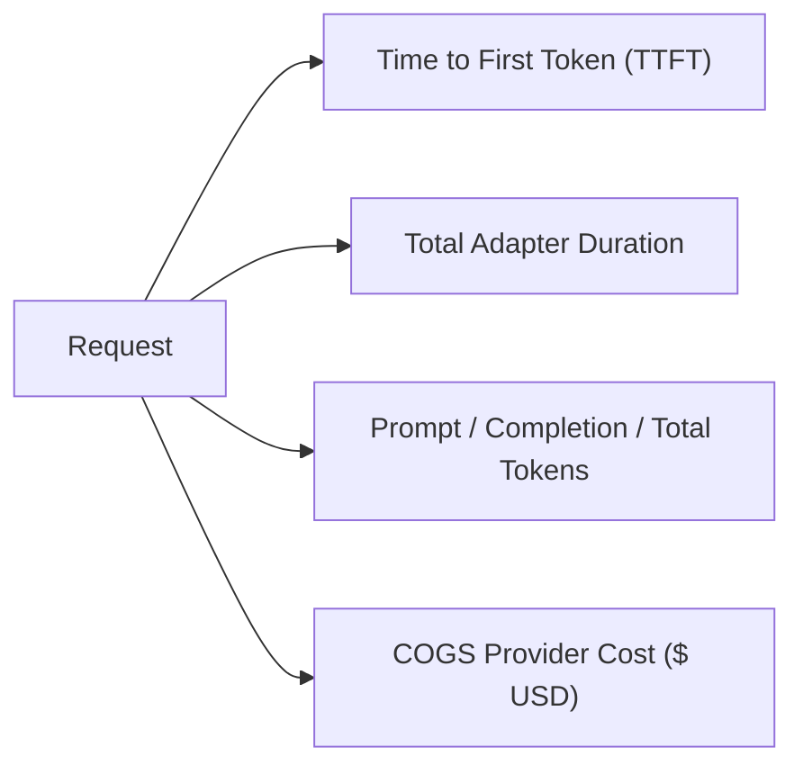

# Usage & Token Metering

Naagmani provides authoritative, real-time telemetry on every token consumed across your organization.

---

## Key Telemetry Metrics

1. **Token Counts**: Prompt tokens, Completion tokens, and Total tokens parsed from provider payloads or computed via tokenizer accumulators.
2. **Time to First Token (TTFT)**: Crucial metric for user-facing streaming applications measuring the delay before the first token chunk arrives.
3. **Calculated COGS (Cost of Goods Sold)**: Real-time calculation of provider costs using published per-million token pricing models.
4. **Authoritative Usage Flag**: Distinguishes between provider-verified token counts and estimated streaming heuristics.

---

## Inspecting Telemetry

- **Usage Dashboard**: View aggregate trends, charts, and project breakdowns at [http://localhost:3000/usage](http://localhost:3000/usage).
- **Attempts Table**: Inspect granular per-request dispatch logs at [http://localhost:3000/attempts](http://localhost:3000/attempts).

---

## Next Steps

- Learn about spending budgets: [FinOps & Budget Hierarchy](billing.md)
- API Reference for attempts: [Provider Attempts API](../api/attempts.md)
