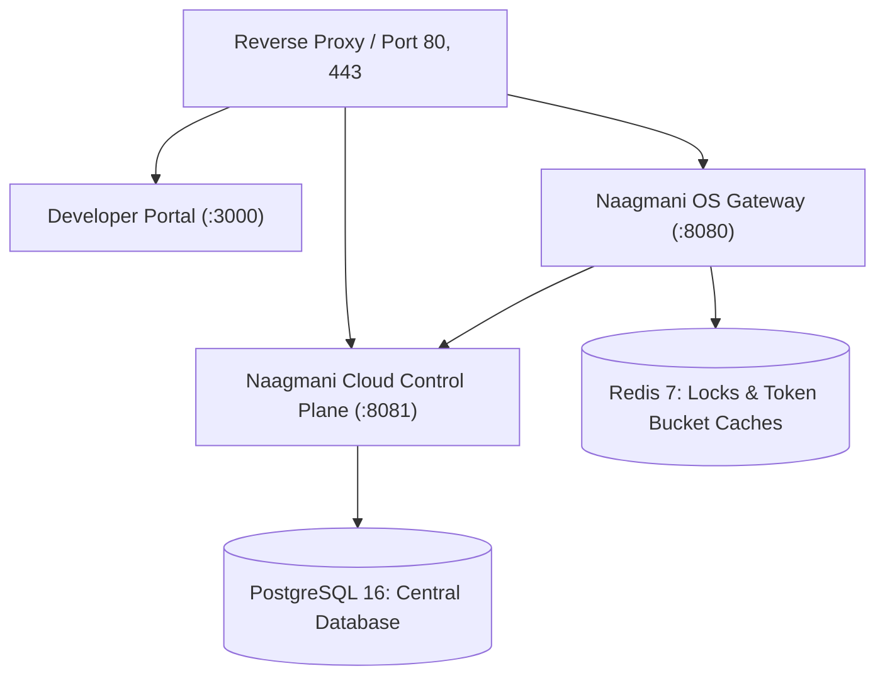

# Docker Compose Deployment

Deploy the complete, single-node Naagmani platform stack using Docker Compose.

---

## Architecture Overview

A production Docker Compose deployment includes 5 core services:



---

## Quick Start Deployment

1. Clone the repository and navigate to deployments:
   ```bash
   git clone https://github.com/bhakha-services/naagmani.git
   cd naagmani
   ```

2. Copy the production environment configuration:
   ```bash
   cp .env.production.example .env.production
   ```

3. Configure your master database passwords and encryption secrets in `.env.production`.

4. Start the platform stack:
   ```bash
   docker compose -f docker-compose.production.yml up -d
   ```

5. Verify running containers:
   ```bash
   docker compose ps
   ```

6. Open `http://localhost:3000` to access the Developer Portal.

---

## Related Documentation

- [Coolify Deployment](file:///e:/project/naagmani-project/naagmani-docs/docs/deploy/coolify.md)
- [Air-Gapped & Offline Setup](file:///e:/project/naagmani-project/naagmani-docs/docs/deploy/offline.md)
