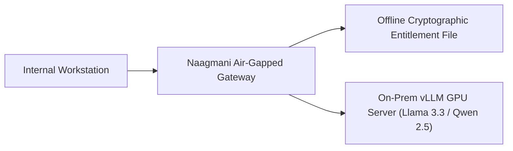

# Air-Gapped & Offline Setup

Deploy Naagmani in zero-egress, air-gapped secure enterprise environments.

---

## Architecture & License Entitlements

In an air-gapped deployment:
- Upstream AI inference targets private on-premises models (via **vLLM**, **Ollama**, or private GPU clusters).
- License entitlements are verified using offline cryptographic public key signatures without calling external license servers.



---

## Offline Installation Steps

1. Export container images on an internet-connected machine:
   ```bash
   docker save naagmani/gateway:latest naagmani/cloud:latest naagmani/portal:latest | gzip > naagmani-images.tar.gz
   ```
2. Transfer the archive to the secure air-gapped bastion host.
3. Load images into the local registry:
   ```bash
   docker load < naagmani-images.tar.gz
   ```
4. Configure `.env.production` with `NAAGMANI_AIR_GAPPED=true` and start containers.

---

## Related Documentation

- [Providers & BYOK (Self-Hosted)](file:///e:/project/naagmani-project/naagmani-docs/docs/developer-portal/organization/providers.md)
- [Docker Compose Deployment](file:///e:/project/naagmani-project/naagmani-docs/docs/deploy/docker-compose.md)
