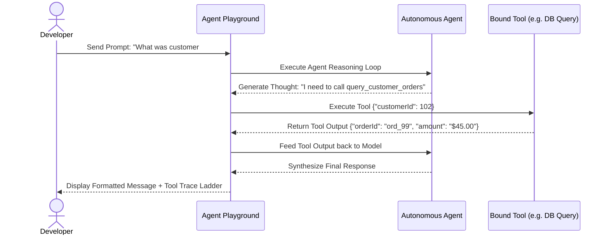

# Agent Playground & Interactive Testing

The **Agent Playground** provides an interactive execution testbed to debug autonomous agents, inspect tool invocations, and observe reasoning steps before deploying to production.

- **Portal Page**: `/projects/[projectId]/playground`

---

## Key Features

1. **Multi-Turn Chat History**: Test conversation continuity and context memory.
2. **Execution Step Inspector**: View exact tool arguments, raw tool responses, and model thoughts.
3. **Parameter Overrides**: Tweak temperature, max tokens, and system instructions on the fly.
4. **Token & Latency Accounting**: Real-time display of tokens consumed during multi-step tool calls.

---

## Next Steps

- Define agent skills: [Skills & Orchestration](skills.md)
- Connect MCP tools: [MCP Servers & Transports](mcp-servers.md)
