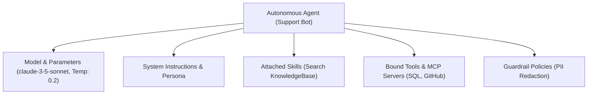

# Autonomous Agents & Assistants

Build, configure, and deploy autonomous AI agents capable of reasoning, calling tools, and querying external data sources.

- **Portal Page**: `/projects/[projectId]/agents`

---

## Agent Configuration Parameters

1. **System Prompt**: Defines the core identity, reasoning guidelines, and behavioral boundaries for the agent.
2. **Model Selection**: Choose specific models or virtual tier aliases (e.g., `smart-tier` for reasoning).
3. **Temperature & Top-P**: Fine-tune determinism vs creativity.
4. **Tool Attachments**: Bind registered custom tools or external MCP server capabilities.
5. **Skill Attachments**: Attach structured few-shot prompt templates and operational skills.

---

## Testing in the Playground

Once configured, click **Open in Playground** to interactively test the agent's multi-turn reasoning and tool invocation trace.

---

## Next Steps

- Test agents interactively: [Agent Playground](agent-playground.md)
- Register custom tools: [Tools & Working Flow](tools.md)
- Connect MCP servers: [MCP Servers & Transports](mcp-servers.md)
