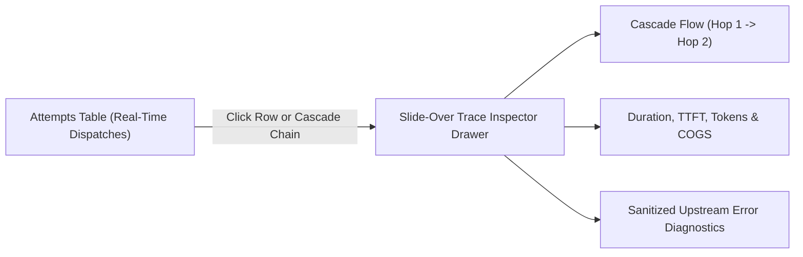

# Provider Attempt Accounting & Trace Inspector

Inspect granular upstream dispatch attempts, Time to First Token (TTFT), token breakdowns, and step-by-step failover cascade ladders.

- **Portal Page**: [http://localhost:3000/attempts](http://localhost:3000/attempts)

---

## Features & Capabilities

### 1. Unified Dispatch Table
- **Attempt & Logical Request ID**: Click to copy IDs instantly.
- **Provider & Model**: Identifies whether the request used Server-Sent Events (SSE) streaming.
- **Status & Latency**: Succeeded, Failed, or Stream Interrupted with exact millisecond duration and TTFT.
- **Token Accounting**: Prompt tokens, Completion tokens, and calculated Cost of Goods Sold (COGS).

### 2. Slide-Over Trace Inspector Drawer
Clicking any row or the **Inspect / Cascade Chain** button slides open the right-hand Inspector Drawer:
- **Direct 1-Hop Execution**: Clean card for single direct dispatches.
- **Multi-Hop Failover Ladder**: Interactive step-by-step ladder showing which provider failed, the exact failure reason (e.g. `HTTP 529 Upstream Overload`), and the secondary provider that succeeded.
- **Diagnostic Panel**: Full sanitized provider error messages and request identifiers.

---

## Next Steps

- API Reference: [Provider Attempts API](../api/attempts.md)
- Explore FinOps: [FinOps & Budget Controls](finops-budgets.md)
