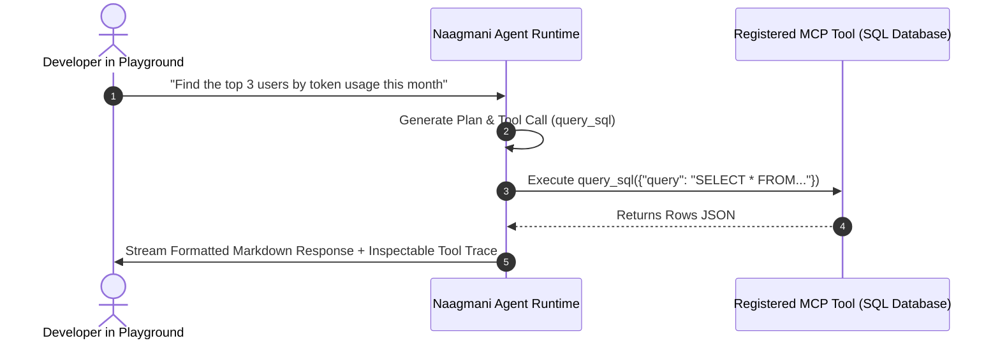

# Agent Playground

The **Agent Playground** is an interactive multi-turn testing environment for debugging AI agents, inspecting reasoning chains, and validating tool execution.

- **Portal Location**: `Projects > [Your Project] > AI & Capabilities > Agent Playground` (`/projects/[slug]/playground`)

---

## Key Features

1. **Multi-Turn Chat History**: Test complex conversational state across multiple turns.
2. **Real-Time Tool Execution Inspection**: View exact JSON parameters passed to registered Tools and external MCP servers.
3. **Step-by-Step Reasoner Logs**: Inspect DeepSeek-R1 / OpenAI reasoning traces and intermediate thought chains.
4. **Instant Parameter Tweaking**: Dynamically adjust temperature, top_p, and active tools without restarting sessions.

---

## How to Test an Agent

1. Select your target agent from the **Agent Selector** dropdown.
2. Enter your message in the chat input.
3. Watch the assistant response stream in real time.
4. Expand the **Tool Trace Drawer** to inspect input arguments, returned payloads, and execution latency.

---

## Related Documentation

- [AI Agents](file:///e:/project/naagmani-project/naagmani-docs/docs/developer-portal/capabilities/agents.md)
- [MCP Servers](file:///e:/project/naagmani-project/naagmani-docs/docs/developer-portal/capabilities/mcp-servers.md)
- [Model Playground](file:///e:/project/naagmani-project/naagmani-docs/docs/developer-portal/operations/model-playground.md)
