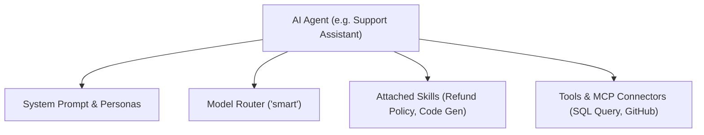

# AI Agents & Assistants

Create, configure, and orchestrate autonomous AI agents equipped with multi-step reasoning, skill prompts, and tool execution bindings.

- **Portal Location**: `Projects > [Your Project] > AI & Capabilities > AI Agents` (`/projects/[slug]/agents`)
- **API Endpoint**: `/v1/agents`

---

## What is an AI Agent?

An **AI Agent** in Naagmani combines:
1. **Core System Prompt**: Base identity, behavioral guidelines, and system persona.
2. **Model Binding**: Association with an underlying foundation model (e.g. `claude-3-5-sonnet`) or dynamic [Routing Policy](file:///e:/project/naagmani-project/naagmani-docs/docs/developer-portal/governance-routing/routing.md) (`smart`).
3. **Skills**: Attached instruction modules for specialized domain knowledge.
4. **Tools & MCP Servers**: Registered functions allowing the agent to query databases, call APIs, or execute external tasks.

---

## Configuring an Agent in Developer Portal

1. Navigate to **AI & Capabilities > AI Agents** (`/projects/[slug]/agents`).
2. Click **Create Agent**.
3. Configure:
   - **Name & Description**: e.g., `Customer Triage Agent`.
   - **Base Model / Routing Alias**: Select `gpt-4o`, `deepseek-chat`, or virtual alias `smart`.
   - **Temperature & Max Tokens**: Sampling hyperparameters.
   - **System Prompt**: Core instruction template.
   - **Assigned Skills & Tools**: Check which tools the agent is permitted to execute.
4. Click **Save Agent**. You can immediately test the agent in the [Agent Playground](file:///e:/project/naagmani-project/naagmani-docs/docs/developer-portal/capabilities/agent-playground.md).

---

## Related Documentation

- [Agent Playground](file:///e:/project/naagmani-project/naagmani-docs/docs/developer-portal/capabilities/agent-playground.md)
- [Skills](file:///e:/project/naagmani-project/naagmani-docs/docs/developer-portal/capabilities/skills.md)
- [Tools Registry](file:///e:/project/naagmani-project/naagmani-docs/docs/developer-portal/capabilities/tools.md)
- [MCP Servers](file:///e:/project/naagmani-project/naagmani-docs/docs/developer-portal/capabilities/mcp-servers.md)
