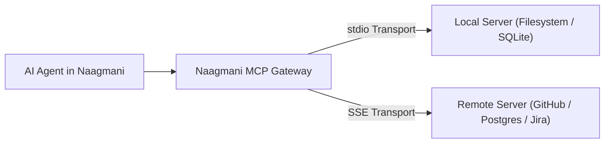

# MCP Servers & Transports

Connect external **Model Context Protocol (MCP)** servers to seamlessly expose remote filesystems, databases, APIs, and tools to your AI applications.

- **Portal Location**: `Projects > [Your Project] > AI & Capabilities > MCP Servers` (`/projects/[slug]/mcp-servers`)
- **API Endpoint**: `/v1/mcp/servers`

---

## What is MCP (Model Context Protocol)?

MCP is an open standard developed to connect AI models with external data sources and tools. 

Naagmani provides a built-in **MCP Gateway** that manages:
1. **Connection Lifecycle**: Maintains long-lived transports (`stdio` subprocesses or `SSE` HTTP streams) to external MCP servers.
2. **Dynamic Tool Discovery**: Automatically discovers tools, resources, and prompts exposed by the remote MCP server.
3. **Governance & Approval Policies**: Applies fine-grained [MCP Tool Policies](file:///e:/project/naagmani-project/naagmani-docs/docs/developer-portal/governance-routing/mcp-policies.md) before executing sensitive actions.

---

## Supported Transport Protocols

| Transport | Connection Target | Configuration Fields |
|---|---|---|
| **`stdio`** | Local binary or command on gateway host. | Command (`npx -y @modelcontextprotocol/server-postgres`), args, environment variables. |
| **`sse`** | Remote HTTP/HTTPS Server-Sent Events stream. | Remote URL (`https://mcp.internal.company.com/sse`), Bearer authorization headers. |

---

## Connecting an MCP Server in Developer Portal

1. In your project workspace, click **AI & Capabilities > MCP Servers**.
2. Click **Add MCP Server**.
3. Configure:
   - **Server Name**: e.g., `GitHub MCP Connector`.
   - **Transport Type**: Select `stdio` or `sse`.
   - **Command / URL**: Endpoint or executable command.
   - **Environment Variables**: e.g. `GITHUB_PERSONAL_ACCESS_TOKEN`.
4. Click **Connect & Probe**. Naagmani executes the MCP handshake and lists all available remote tools.

---

## Related Documentation

- [MCP Tool Policies](file:///e:/project/naagmani-project/naagmani-docs/docs/developer-portal/governance-routing/mcp-policies.md)
- [Tools Registry](file:///e:/project/naagmani-project/naagmani-docs/docs/developer-portal/capabilities/tools.md)
- [Agent Playground](file:///e:/project/naagmani-project/naagmani-docs/docs/developer-portal/capabilities/agent-playground.md)
