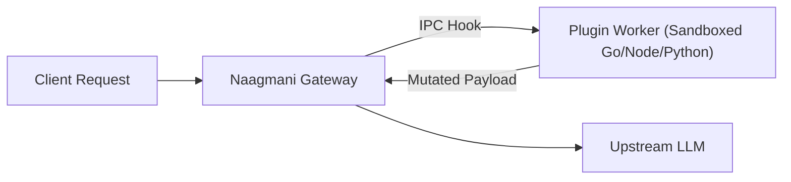

# Plugins & Local Tools

Manage local and project-installed capability plugins that extend Naagmani Gateway's request pipeline.

- **Portal Location**: `Projects > [Your Project] > AI & Capabilities > Plugins & Tools` (`/projects/[slug]/plugins`)
- **API Endpoint**: `/v1/plugins`

---

## What are Plugins?

**Plugins** are sandboxed worker processes built using the [Naagmani HDK](file:///e:/project/naagmani-project/naagmani-docs/docs/build/hdks/overview.md). They hook directly into the gateway's execution pipeline to:
- Intercept and rewrite prompts (`pre_route`, `pre_model_call`).
- Inspect and redact model outputs (`post_response`, DLP).
- Expose native functions directly to AI agents.

---

## Managing Project Plugins

1. In your project workspace, navigate to **AI & Capabilities > Plugins & Tools**.
2. View all active plugins installed in the current environment.
3. Configure environment variables, inspect invocation metrics, or toggle plugins on/off.
4. To discover and install new community plugins, visit the [Marketplace](file:///e:/project/naagmani-project/naagmani-docs/docs/marketplace/overview.md).

---

## Related Documentation

- [Marketplace Installation](file:///e:/project/naagmani-project/naagmani-docs/docs/marketplace/installation.md)
- [HDK Plugin Development](file:///e:/project/naagmani-project/naagmani-docs/docs/build/hdks/development.md)
