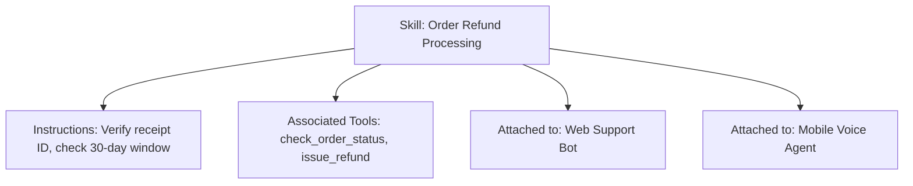

# Skills

**Skills** are reusable domain instruction bundles and procedural guidelines that can be attached to AI Agents to standardize behaviors across workloads.

- **Portal Location**: `Projects > [Your Project] > AI & Capabilities > Skills` (`/projects/[slug]/skills`)
- **API Endpoint**: `/v1/skills`

---

## What is a Skill?

A Skill encapsulates:
- **System Instructions**: High-precision prompt templates for specific tasks (e.g. `Refund Processing`, `SQL Query Generation`, `PR Code Review`).
- **Required Tools**: Associated functions needed to fulfill the skill.
- **Constraints & Edge Cases**: Clear behavioral rules explaining what the agent should and should not do.

---

## Authoring a Skill in Developer Portal

1. In your project workspace, click **AI & Capabilities > Skills**.
2. Click **Create Skill**.
3. Define:
   - **Skill Name & Slug**: e.g. `Order Refund Policy` (`order-refund`).
   - **Description**: What this skill empowers agents to do.
   - **Instruction Prompt**: Markdown formatted guidelines and few-shot examples.
   - **Allowed Tools**: Select which tools this skill can trigger.
4. Click **Save Skill**. The skill can now be toggled on any project agent.

---

## Related Documentation

- [AI Agents](file:///e:/project/naagmani-project/naagmani-docs/docs/developer-portal/capabilities/agents.md)
- [Tools Registry](file:///e:/project/naagmani-project/naagmani-docs/docs/developer-portal/capabilities/tools.md)
