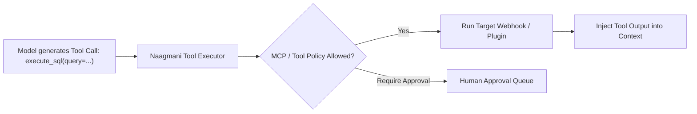

# Tools Registry

The **Tools Registry** provides a unified catalog of executable functions, REST API endpoints, and webhook triggers exposed to your AI agents and models.

- **Portal Location**: `Projects > [Your Project] > AI & Capabilities > Tools` (`/projects/[slug]/tools`)
- **API Endpoint**: `/v1/tools`

---

## What is a Tool?

A **Tool** follows the standard JSON Schema function-calling specification supported by models like GPT-4o, Claude 3.5 Sonnet, and DeepSeek:
1. **Name**: Unique identifier (e.g. `get_weather`, `execute_sql`).
2. **Description**: Clear explanation of when and why the model should invoke this tool.
3. **Parameters (JSON Schema)**: Argument names, types, constraints, and descriptions.
4. **Execution Handler**: Webhook URL, local plugin worker, or external MCP server.



---

## Registering a Tool in Developer Portal

1. In your project workspace, click **AI & Capabilities > Tools**.
2. Click **Add Tool**.
3. Fill out:
   - **Tool Name**: e.g., `lookup_customer`.
   - **Description**: "Retrieves customer profile and active subscriptions by email address."
   - **Parameters Schema (JSON)**:
     ```json
     {
       "type": "object",
       "properties": {
         "email": {
           "type": "string",
           "description": "The customer email address."
         }
       },
       "required": ["email"]
     }
     ```
   - **Target Endpoint**: Webhook URL or MCP Server binding.
4. Click **Save Tool**.

---

## Related Documentation

- [AI Agents](file:///e:/project/naagmani-project/naagmani-docs/docs/developer-portal/capabilities/agents.md)
- [MCP Tool Policies](file:///e:/project/naagmani-project/naagmani-docs/docs/developer-portal/governance-routing/mcp-policies.md)
- [MCP Servers](file:///e:/project/naagmani-project/naagmani-docs/docs/developer-portal/capabilities/mcp-servers.md)
