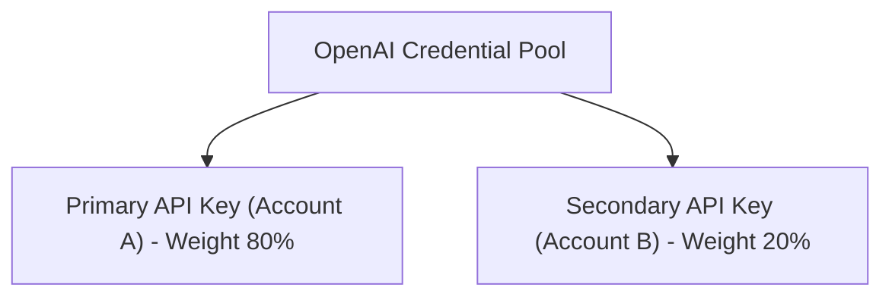

# BYOK & Credential Pools

Store your direct commercial provider credentials securely in the **Bring-Your-Own-Key (BYOK)** encrypted vault and configure failover pools.

- **Portal Page**: [{{DEVELOPER_PORTAL_URL}}/providers]({{DEVELOPER_PORTAL_URL}}/providers)

---

## Configuring Provider Credentials

1. Navigate to **Providers** in the Developer Portal ([{{DEVELOPER_PORTAL_URL}}/providers]({{DEVELOPER_PORTAL_URL}}/providers)).
2. Click on the desired provider (e.g. **OpenAI**, **Anthropic**, **Google**, or **DeepSeek**).
3. Enter your provider API Key and optional Organization ID.
4. Click **Connect Provider**.
5. Keys are encrypted with AES-256-GCM.

---

## Next Steps

- Configure routing cascades: [Smart Routing Policies](routing-policies.md)
- View attempt telemetry: [Provider Attempt Accounting](attempts.md)
