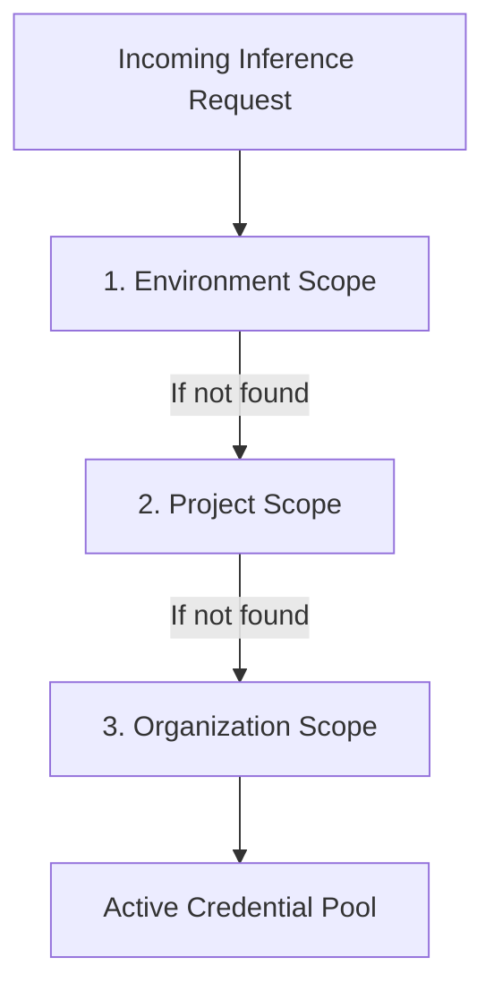

# BYOK & Credential Pool Failover

Bring Your Own Key (BYOK) stores AES-256-GCM encrypted provider credentials with automatic fallback when rate limits (HTTP 429) or upstream provider outages occur.

---

## Hierarchical Credential Resolution

Naagmani resolves API credentials in a strict 3-tier hierarchy:



### Key Principles

- **Scope Precedence**: Keys defined at the Environment level override Project keys, which in turn override Organization-wide defaults.
- **Intra-Provider Failover**: When a provider key encounters a `429 Rate Limit` or `5xx Server Error`, Naagmani immediately retries the request against alternative healthy credentials within the same pool.
- **Adaptive Cooldown**: Exhausted keys are automatically removed from rotation for a dynamically calculated cooldown window based on `Retry-After` headers.

---

## Adding Credentials via API

You can programmatically configure credential pools using the Naagmani Cloud Provider API:

```json
POST /v1/providers
{
  "provider": "openai",
  "name": "Production Tier 4 Key",
  "credential": "sk-proj-...",
  "priority": 1,
  "weight": 100
}
```
