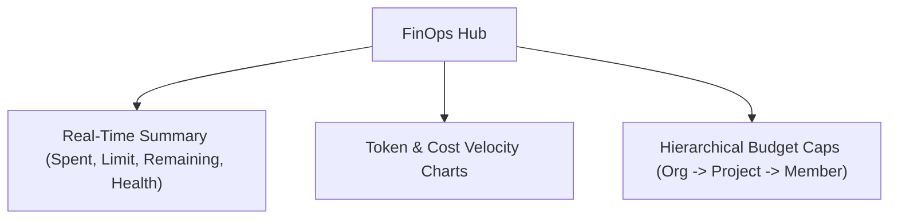

# FinOps & Budget Controls

Monitor organization-wide spending velocity, enforce multi-tier budget caps, and analyze cost breakdowns across projects and members.

- **Portal Page**: [http://localhost:3000/usage](http://localhost:3000/usage)

---

## Setting Organization & Project Budgets

1. Navigate to the **Usage & FinOps** hub at [http://localhost:3000/usage](http://localhost:3000/usage).
2. Click **+ Create Budget Target**.
3. Select your budget scope (**Organization**, **Project**, or **Environment**).
4. Set your **Monthly Limit** (e.g. `$5,000.00`) and alert notification threshold (e.g. `80%`).
5. Click **Deploy Budget**.

---

## Next Steps

- Manage member limits: [Members & Access Control](members.md)
- API Reference: [FinOps & Budgets API](../api/budgets.md)
