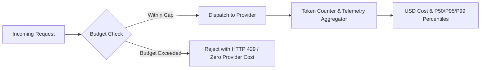

# FinOps Spend Controls & Quotas

Deterministic cost estimation and hard budget limits in Naagmani guarantee **zero upstream provider cost** whenever quotas or budget limits are breached.

---

## FinOps Telemetry & Enforcement

### Core Features

1. **Hard Spend Caps**:
   - Spend limits are enforced locally at the gateway prior to dispatching inference requests upstream.
   - Guarantees zero dollar overrun during unexpected agent loops or traffic surges.

2. **Sliding Window Quotas**:
   - Granular request and token quotas evaluated per-project or per-environment.
   - Standard HTTP 429 response codes with precision `Retry-After` headers.

3. **Real-time Latency & Token Analytics**:
   - Track prompt tokens, completion tokens, and dollar costs mapped to provider rate cards.
   - Percentile latency telemetry (P50, P95, P99) for all model routes.
