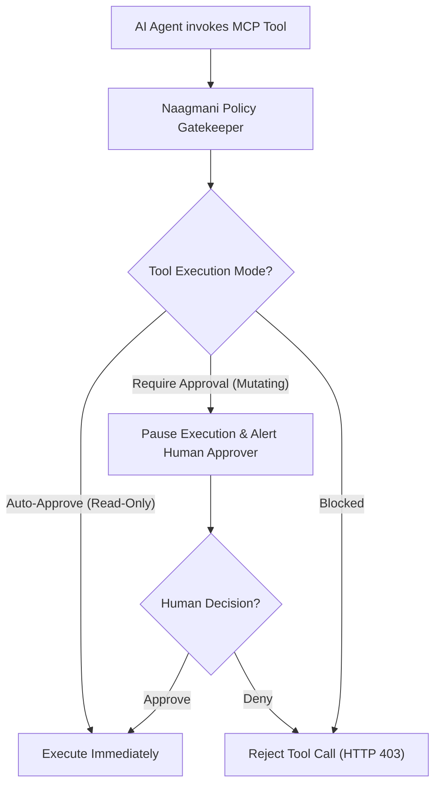

# MCP Tool Policies & Approvals

Establish enterprise governance, security rules, and human-in-the-loop approval workflows for tools and external Model Context Protocol (MCP) servers.

- **Portal Location**: `Projects > [Your Project] > Governance & Routing > MCP Tool Policies` (`/projects/[slug]/mcp-policies`)
- **API Endpoint**: `/v1/mcp/policies`

---

## Why MCP Tool Policies?

Giving AI agents autonomous access to external systems (e.g., executing SQL updates, deleting files, sending emails, initiating payments) poses significant operational and security risks.

**MCP Tool Policies** enforce strict execution modes on a per-tool, per-role, or per-environment basis:

---

## Tool Execution Modes

| Policy Mode | Behavior | Recommended Use Cases |
|---|---|---|
| **Auto-Approve** | The tool executes instantly without pausing the agent pipeline. | Read-only tools (`get_customer`, `read_file`, `search_docs`). |
| **Require Approval** | The request pauses and generates an approval ticket in the Developer Portal. The agent waits for a human admin decision. | Destructive or mutating tools (`update_db`, `delete_repo`, `charge_card`). |
| **Disabled / Blocked** | The tool cannot be invoked under any circumstances. | High-risk legacy or deprecated functions. |

---

## Configuring Tool Policies in Developer Portal

1. In your project workspace, click **Governance & Routing > MCP Tool Policies**.
2. Locate the target tool or MCP server connector.
3. Set the default action (`Auto-Approve`, `Require Approval`, or `Block`).
4. Optionally configure **Approval Expiration** (e.g., reject tool call if no human responds within 15 minutes).

---

## Related Documentation

- [MCP Servers](file:///e:/project/naagmani-project/naagmani-docs/docs/developer-portal/capabilities/mcp-servers.md)
- [AI Agents](file:///e:/project/naagmani-project/naagmani-docs/docs/developer-portal/capabilities/agents.md)
- [AI Guardrails](file:///e:/project/naagmani-project/naagmani-docs/docs/developer-portal/governance-routing/guardrails.md)
