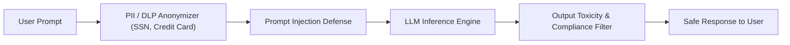

# AI Guardrails & Content Governance

Protect your applications from prompt injection, sensitive data leakage (PII/DLP), and toxic content using Naagmani's multi-layered guardrail pipeline.

- **Portal Page**: `/projects/[projectId]/governance`

---

## Active Guardrail Filters

1. **PII Masking & Redaction**: Automatically redacts social security numbers, credit card details, phone numbers, and email addresses before sending prompts upstream.
2. **Prompt Injection & Jailbreak Defense**: Detects adversarial jailbreak techniques and overrides.
3. **Output Content Moderation**: Scans model responses for hate speech, violence, and proprietary corporate secrets.

---

## Next Steps

- Build model routing rules: [Smart Routing Policies](routing-policies.md)
- Review audit logs: [Security Audit Logs](audit-logs.md)
