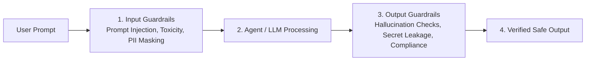

# AI Guardrails & Governance

Naagmani **AI Guardrails** provide enterprise-grade safety, compliance, prompt injection prevention, and PII anonymization for all agent reasoning loops and model requests.

---

## 1. Guardrail Inspection Pipeline

### Core Protection Modules:
1. **PII Masking**: Automatically detects and redacts emails, credit card numbers, Social Security Numbers, and API keys before dispatch to LLMs.
2. **Prompt Injection Defense**: Blocks jailbreaking attempts and unauthorized prompt alteration attacks.
3. **Secret Leakage Prevention**: Prevents downstream models from returning system passwords, tokens, or internal URLs.
4. **Content Moderation**: Enforces enterprise toxicity, safety, and brand tone guidelines.

---

## 2. Managing Guardrails in Developer Portal

1. Navigate to **Projects** $\rightarrow$ `[Your Project]` $\rightarrow$ **AI Guardrails** (`/projects/[projectId]/governance`).
2. Toggle active guardrail layers (PII Masking, Toxicity, Injection Guard).
3. Define custom regex patterns or blocklists.
4. Save and inspect guardrail violation logs in the project audit trail.

---

## 3. Related Documentation

- [Security Overview](../security/overview.md)
- [Data Protection & Encryption](../security/data-protection.md)
- [MCP Tool Policies](./mcp-policies.md)
