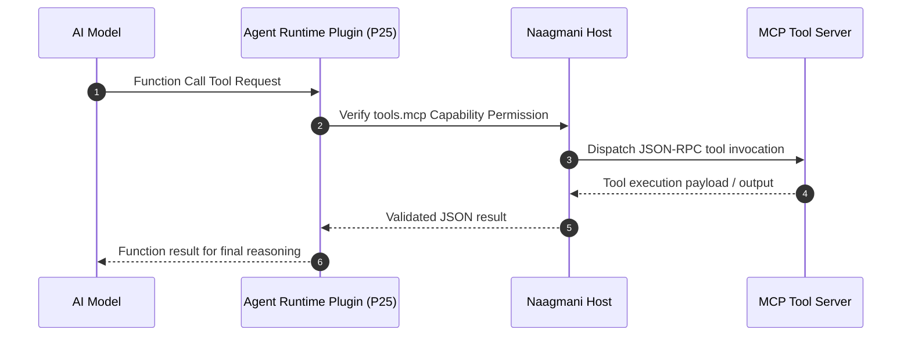

# Model Context Protocol (MCP) Integration

Naagmani OS provides first-class support for the Model Context Protocol (MCP), enabling AI models and agent loops to discover, validate, and invoke external enterprise tools and data sources safely.

---

## MCP Tool Invocation Flow

---

## Capabilities & Governance

- **Dynamic Tool Discovery**: Plugins expose tool specifications and JSON schemas dynamically during the `initialize` handshake.
- **Multi-Step Agent Loop**: Orchestrated safely by the `agent-runtime` plugin (Priority 25) with configurable max turn limits.
- **Enterprise Policy Gates**: Environments can selectively allow or restrict `tools.mcp` capabilities based on data sensitivity and project rules.
