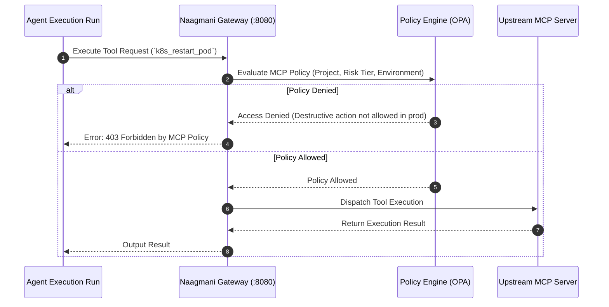

# MCP Tool Policies & Enterprise Governance

**MCP Tool Policies** enforce fine-grained access control, risk tier boundaries, parameter sanitation, and rate limits on external tools provided by Model Context Protocol (MCP) servers.

---

## 1. Policy Enforcement Architecture

---

## 2. Policy Controls

- **Risk Tier Restrictions**: Automatically block `DESTRUCTIVE` tools in production environments or require human sign-off.
- **Allowed Server Whitelisting**: Restrict projects to specific approved MCP servers.
- **Tenant Rate Limits**: Throttle tool calls to avoid overwhelming downstream enterprise services.

---

## 3. Configuring Policies in Developer Portal

1. Navigate to **Projects** $\rightarrow$ `[Your Project]` $\rightarrow$ **MCP Tool Policies** (`/projects/[projectId]/mcp-policies`).
2. Click **Add Policy Rule**.
3. Select the target MCP Server, Tool, and allowed Environments.
4. Set allowed action types (`READ`, `WRITE`, `ALL`).
5. Save the policy to apply changes instantly across all agent runtimes.

---

## 4. Related Documentation

- [MCP Servers & Integration](./mcp-servers.md)
- [Tools Architecture & Working Flow](./tools.md)
- [Smart Model Routing](../concepts/routing.md)
