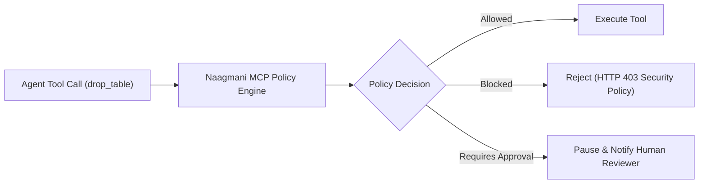

# MCP Tool Policies & Enterprise Governance

Enforce granular security guardrails, allowlists, and execution approval workflows on tools exposed via Model Context Protocol (MCP) servers.

- **Portal Page**: `/projects/[projectId]/mcp-policies`

---

## Policy Types

1. **Tool Allowlists & Blocklists**: Explicitly allow or prohibit specific tools (e.g. allow `read_file`, block `delete_file`).
2. **Parameter Constraints**: Restrict tool parameters (e.g., limit SQL queries to `SELECT` statements only).
3. **Human-in-the-Loop Approvals**: Pause destructive tool executions until an administrator approves the action.
4. **Rate Limiting**: Cap the number of times an agent can invoke a specific tool per minute.

---

## Next Steps

- Configure content guardrails: [AI Guardrails & Governance](guardrails.md)
- View security audit trail: [Security Audit Logs](audit-logs.md)
