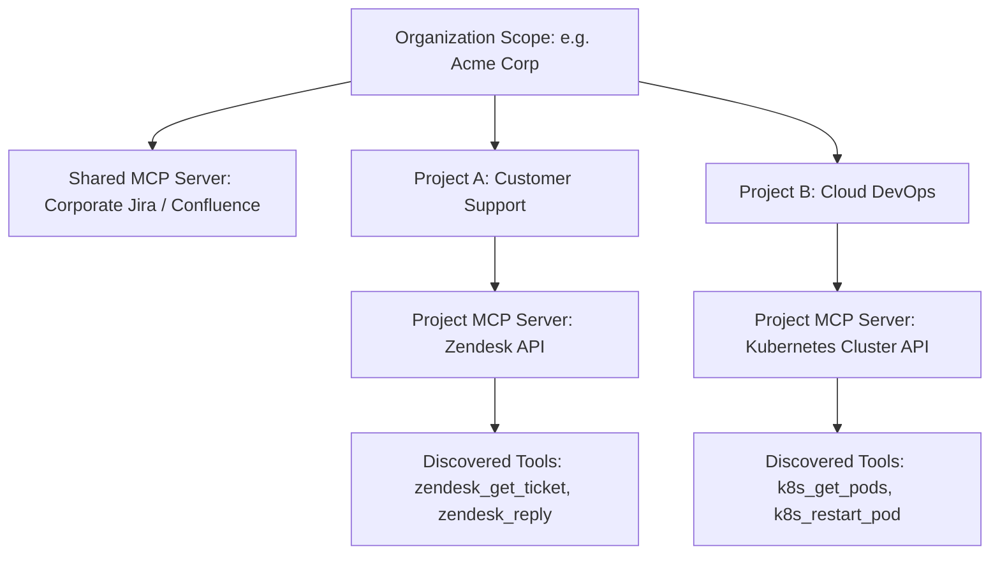
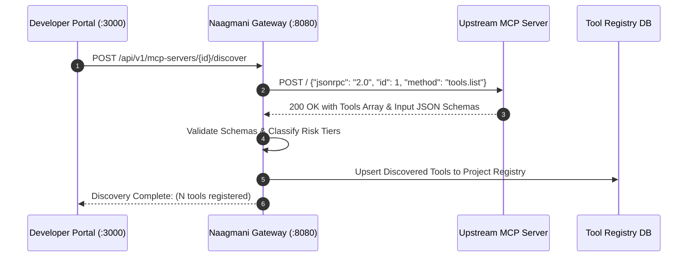

# Model Context Protocol (MCP) Servers & Integration

The **Model Context Protocol (MCP)** is an open standard that allows AI models and agent runtimes to access external tools, resources, and enterprise APIs seamlessly without writing custom connectors. 

In **Naagmani**, MCP servers act as standardized capability providers that are managed inside the Developer Portal and governed by enterprise policies.

---

## 1. Architectural Overview & Hierarchy

MCP servers in Naagmani are scoped at the **Organization** or **Project** level:



### Hierarchy Precedence:
- **Organization-Level Servers**: Available across all projects within the enterprise tenant.
- **Project-Level Servers**: Isolated to specific team workspaces for departmental security boundaries.

---

## 2. Supported Transports

Naagmani OS supports three high-performance MCP transports:

| Transport | Option Key | Streaming | Best For |
| :--- | :--- | :--- | :--- |
| **Streamable HTTP** *(Recommended)* | `streamable-http` | Bidirectional Chunked | Production cloud deployments, microservices, remote VPC endpoints, Kubernetes clusters |
| **Server-Sent Events (SSE)** | `sse` | Server-to-Client | Asynchronous notification servers, real-time event feeds |
| **Standard I/O (stdio)** | `stdio` | Process Pipe | Air-gapped local sandboxes, CLI binaries (e.g. `npx -y @modelcontextprotocol/server-postgres`) |

---

## 3. Authentication & Secret Management

Naagmani implements **Zero-Trust Credential Injection**. Upstream AI models never receive raw passwords or tokens:

1. **Bearer Token (`bearer`)**:
   - Injected as `Authorization: Bearer <token>`.
2. **API Key Header (`api_key`)**:
   - Configurable custom header (e.g. `X-API-Key`, `api-key`).
3. **HTTP Basic Auth (`basic`)**:
   - Standard Base64 encoded `username:password`.
4. **Custom Headers (`custom_headers`)**:
   - Multi-tenant tenant IDs, routing headers, and HMAC signatures.
5. **No Auth (`none`)**:
   - Reserved for internal cluster sidecars and localhost proxies.

---

## 4. Tool Discovery Handshake (`tools.list`)

When an MCP server is registered or refreshed in the Developer Portal, Naagmani's discovery daemon executes a standardized JSON-RPC handshake:



### Discovery Request & Response Example:

```json
// Naagmani -> MCP Server
{
  "jsonrpc": "2.0",
  "id": "nm-disc-01",
  "method": "tools.list",
  "params": {}
}

// MCP Server -> Naagmani
{
  "jsonrpc": "2.0",
  "id": "nm-disc-01",
  "result": {
    "tools": [
      {
        "name": "query_inventory",
        "description": "Query live product stock levels from SAP ERP",
        "inputSchema": {
          "type": "object",
          "properties": {
            "sku": { "type": "string", "description": "Product SKU" }
          },
          "required": ["sku"]
        }
      }
    ]
  }
}
```

---

## 5. Step-by-Step Developer Runbook

### Step 1: Add MCP Server in Developer Portal
1. Navigate to **Projects** $\rightarrow$ `[Your Project]` $\rightarrow$ **MCP Servers** (`/projects/[projectId]/mcp-servers`).
2. Click **Add MCP Server**.
3. Enter:
   - **Server Name**: e.g., `GitHub Enterprise MCP`.
   - **Endpoint URL**: e.g., `https://mcp.github.internal.net/v1`.
   - **Transport**: Select `Streamable HTTP` (or `SSE` / `stdio`).
   - **Authentication**: Choose `Bearer Token` or `API Key` and input your secret.
4. Click **Create MCP Server**.

### Step 2: Test Connection & Discover Tools
1. Click **Test Connection** to verify latency and endpoint health.
2. Click **Discover Tools**. Naagmani will query `tools.list`, inspect the schemas, and register them.
3. Once complete, navigate to **Tools** (`/projects/[projectId]/tools`) to inspect and use the newly discovered tools in your agent playground!

---

## 6. Related Documentation

- [Tools Architecture & Working Flow](./tools.md)
- [Developer Portal Overview](./overview.md)
- [Plugin Protocol (v1)](./plugin-protocol.md)
- [FinOps & Budget Controls](./finops-budgets.md)
