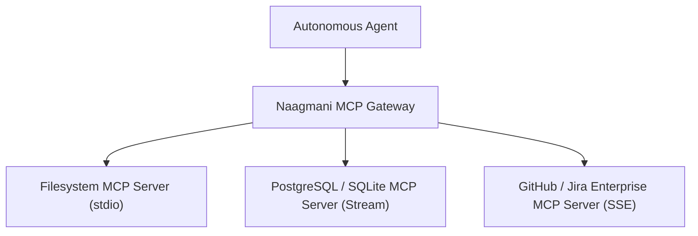

# Model Context Protocol (MCP) Servers

Naagmani provides first-class support for the **Model Context Protocol (MCP)**, the open standard for connecting AI agents to external tools, databases, and enterprise data sources.

- **Portal Page**: `/projects/[projectId]/mcp-servers`

---

## Supported MCP Transports

| Transport | Description | Best For |
| :--- | :--- | :--- |
| **`stdio`** | Standard input/output process pipes. | Local tools, developer CLI tools, sandboxed binaries. |
| **`sse`** | Server-Sent Events over HTTP. | Remote cloud tools, web services, SaaS integrations. |
| **`stream`** | Raw bidirectional TCP/HTTP streaming. | High-throughput enterprise microservices. |

---

## Connecting an MCP Server

1. Navigate to **MCP Servers** in your active Project.
2. Click **+ Connect MCP Server**.
3. Select the transport type (`stdio`, `sse`, or `stream`).
4. Enter connection parameters (e.g. command path or SSE endpoint URL).
5. Click **Connect & Discover Tools**. Naagmani will query the server and register all exposed tools automatically.

---

## Next Steps

- Define security policies: [MCP Tool Policies](mcp-policies.md)
- Test in playground: [Agent Playground](agent-playground.md)
