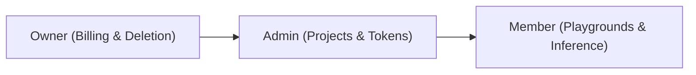

# Members & Access Control

Manage team members, assign Role-Based Access Control (RBAC) permissions, and enforce individual spending limits directly in the Developer Portal.

- **Portal Page**: [http://localhost:3000/members](http://localhost:3000/members)

---

## Member Roles & Permissions

| Permission | Owner | Admin | Member |
| :--- | :---: | :---: | :---: |
| Delete Organization | Yes | No | No |
| Manage Billing & Org Budget | Yes | No | No |
| Invite Members & Update Roles | Yes | Yes | No |
| Create & Delete Projects | Yes | Yes | No |
| Create Project Service Tokens | Yes | Yes | Yes |
| Use Playgrounds & Inference | Yes | Yes | Yes |

---

## Setting Member-Specific Spending Limits

1. Navigate to the **Members** page at [http://localhost:3000/members](http://localhost:3000/members).
2. Click on a member to open their **Member Detail Profile** (e.g. `/members/mbr_123...`).
3. Under the **Spending Budget & Hierarchy Governance** card, click **Modify Member Budget**.
4. Enter the desired **Monthly Limit Amount** (e.g. `$200.00`).
5. Click **Save Budget**.

> [!NOTE]
> **Hierarchy Rule Enforcement**  
> A member's spending limit cannot exceed the parent Organization's monthly limit. If the organization budget is $3,000, setting a member cap of $30,000 will be cleanly rejected.

---

## Next Steps

- Issue machine credentials: [Project Service Tokens](service-tokens.md)
- View organization FinOps: [FinOps & Budget Controls](finops-budgets.md)
