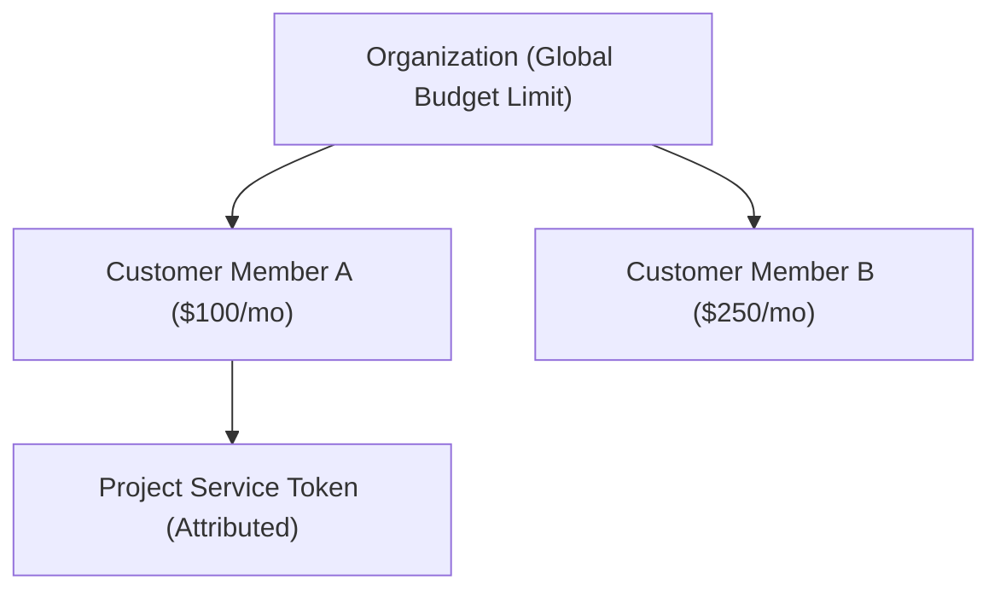

# Customer Members Directory & Spending Limits

The **Customer Members** directory allows you to manage end-user and application member identities for token usage attribution, per-member spending limits, and FinOps governance.

- **Portal Page**: [{{DEVELOPER_PORTAL_URL}}/members]({{DEVELOPER_PORTAL_URL}}/members)

> [!IMPORTANT]
> **Customer Members vs. Portal Users**  
> Customer Members are application and end-user identities used by LLM workloads and backend services. They **do not** have Developer Portal login accounts.  
> To manage internal team members and administrators who have Developer Portal access, see [Portal Users](users.md).

---

## Setting Member-Specific Spending Limits

1. Navigate to the **Customer Members** page at [{{DEVELOPER_PORTAL_URL}}/members]({{DEVELOPER_PORTAL_URL}}/members).
2. Click **Add Customer Member** or select an existing member.
3. In the member modal or budget modal, enter the desired **Daily Limit Amount** or **Monthly Limit Amount** (e.g. `$200.00`).
4. Click **Save Budget**.

> [!NOTE]
> **Hierarchy Rule Enforcement**  
> A member's spending limit cannot exceed the parent Organization's monthly limit. If the organization budget is $3,000, setting a member cap of $30,000 will be rejected with an error.

---

## Attribution in Workloads

Applications can attribute LLM inference calls to a specific Customer Member using:
- The `X-Naagmani-Member-Id` HTTP header.
- Binding the API Key or Service Token to a specific `member_id`.

---

## Next Steps

- [Portal Users Management](users.md)
- [Project Service Tokens](service-tokens.md)
- [FinOps & Budget Controls](finops-budgets.md)
