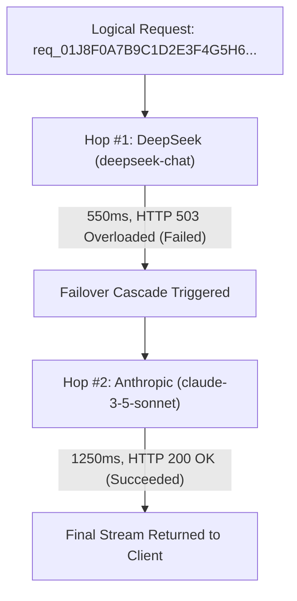

# Provider Attempt Accounting & Telemetry

Inspect full-stack execution traces, hop-by-hop latency breakdowns, token costs, and automated failover recoveries for every request dispatched by Naagmani.

- **Portal Location**: `Organization > Provider Attempts` (`/attempts`)
- **API Endpoint**: `/v1/attempts`

---

## What is a Provider Attempt?

When a client application sends a single logical request to `/v1/chat/completions`, Naagmani may execute one or more **Upstream Provider Attempts** to fulfill it (for example, if Candidate #1 experiences a timeout or 429 rate limit and fails over to Candidate #2).

**Provider Attempt Accounting** records the complete execution lifecycle for every hop:

---

## Telemetry Attributes Recorded per Attempt

For every upstream attempt, Naagmani captures:

| Telemetry Field | Description | Example |
|---|---|---|
| `attempt_id` | Unique identifier for this specific provider dispatch hop. | `att_01J9H2X9F8E7...` |
| `request_id` | Parent logical request ID grouping multi-hop cascades. | `req_01J9H2X9F8E7...` |
| `provider` | Target upstream vendor name. | `deepseek`, `anthropic`, `openai` |
| `model` | Specific upstream model executed. | `deepseek-chat`, `gpt-4o` |
| `status_code` | Raw HTTP response code from the provider. | `200`, `429`, `503` |
| `latency_ms` | Total end-to-end duration of this attempt in milliseconds. | `450ms` |
| `time_to_first_token_ms` | Initial streaming TTFT latency. | `180ms` |
| `prompt_tokens` / `completion_tokens` | Exact billable token counts. | `142` prompt / `350` completion |
| `cost_cogs_usd` | Exact provider cost of this hop calculated from active price books. | `$0.00042` |
| `error_message` | Raw error payload if the attempt failed. | `upstream server overloaded` |

---

## Inspecting Traces in Developer Portal

1. Navigate to **Organization > Provider Attempts** (`/attempts`).
2. Filter by:
   - **Date Range**: Last 15 minutes, 24 hours, 7 days.
   - **Status**: Successful only (`200`), Failed only (`4xx/5xx`), or Multi-hop cascades.
   - **Project / Environment**: Filter by specific application.
3. Click any row to expand the detailed trace drawer: view hop timing waterfall, exact token breakdowns, and raw header metadata.

---

## Related Documentation

- [Smart Routing Policies](file:///e:/project/naagmani-project/naagmani-docs/docs/developer-portal/governance-routing/routing.md)
- [Usage & Token Analytics](file:///e:/project/naagmani-project/naagmani-docs/docs/developer-portal/operations/usage.md)
- [Provider Attempts API](file:///e:/project/naagmani-project/naagmani-docs/docs/api/attempts.md)
