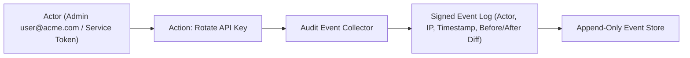

# Security Audit Logs

Maintain an immutable, tamper-evident audit trail of all administrative mutations, credential rotations, policy updates, and security events across your organization.

- **Portal Location**: `Organization > Audit Logs` (`/audit-logs`) or `Projects > [Your Project] > Operations > Audit Logs` (`/projects/[slug]/audit-logs`)
- **API Endpoint**: `/v1/audit-logs`

---

## What is Recorded in Audit Logs?

Every security-relevant action taken via the Developer Portal, CLI, or Management API generates an immutable audit record:

---

## Event Categories & Payload Structure

| Event Type | Action Triggered | Recorded Details |
|---|---|---|
| `auth.apikey.created` | New API key generated | Key ID, Name, Target Environment, Creator User ID |
| `auth.apikey.rotated` | API key rotated | Key ID, Grace period hours, Successor Key ID |
| `auth.apikey.revoked` | API key deleted | Key ID, Revoking User ID, Timestamp |
| `provider.credential.updated`| BYOK provider secret updated | Provider Name, Modifying Admin (Secrets are never logged in plaintext) |
| `policy.routing.updated` | Routing rule or model priority changed | Policy Name, Old Candidates JSON, New Candidates JSON |
| `guardrail.violation` | PII or Prompt injection blocked | Rule ID, Violation Type, Masking action applied |

---

## Viewing Audit Logs in Developer Portal

1. Navigate to **Organization > Audit Logs** (`/audit-logs`).
2. Search and filter by:
   - **Actor**: Specific user email or service token ID.
   - **Resource Type**: `api_key`, `routing_policy`, `provider`, `agent`.
   - **Action**: `create`, `update`, `delete`, `rotate`.
3. Click any event row to inspect the JSON metadata and diff.

---

## Related Documentation

- [Roles & Permissions (RBAC)](file:///e:/project/naagmani-project/naagmani-docs/docs/developer-portal/organization/roles.md)
- [API Keys & Vault](file:///e:/project/naagmani-project/naagmani-docs/docs/developer-portal/projects/api-keys.md)
- [AI Guardrails](file:///e:/project/naagmani-project/naagmani-docs/docs/developer-portal/governance-routing/guardrails.md)
