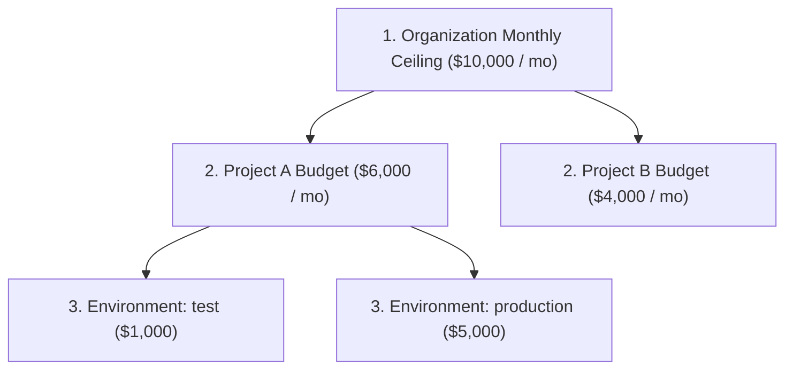

# FinOps & Budget Controls

Establish hierarchical spending ceilings, hard and soft budget alerts, and automated throttling policies to eliminate unexpected AI billing spikes.

- **Portal Location**: `Organization > Billing` (`/billing`) or Project Settings
- **API Endpoint**: `/v1/budgets`

---

## Hierarchical Budget Architecture

Naagmani enforces financial governance using a 3-level budget cascade:

---

## Budget Threshold Actions

When spend approaches or crosses configured limits:

| Threshold | Trigger | Action Taken |
|---|---|---|
| **Soft Alert (80%)** | Monthly spend reaches 80% of budget. | Dispatches webhook and email notification to billing managers. No traffic is interrupted. |
| **Warning (95%)** | Monthly spend reaches 95% of budget. | High-priority alert dispatched. Non-critical batch jobs can be throttled. |
| **Hard Ceiling (100%)** | Monthly spend reaches 100% of budget. | Gateway automatically blocks further paid inference with `HTTP 403: project budget exceeded`. |

---

## Real-Time Price Book & COGS Calculation

Naagmani maintains real-time price books for all supported model providers:
$$\text{Cost} = (\text{Prompt Tokens} \times \text{Input Rate}) + (\text{Completion Tokens} \times \text{Output Rate})$$

Example:
- `deepseek-chat`: $0.14 / 1M prompt tokens, $0.28 / 1M completion tokens.
- `gpt-4o`: $2.50 / 1M prompt tokens, $10.00 / 1M completion tokens.

When using the [Lowest Cost Routing Strategy](file:///e:/project/naagmani-project/naagmani-docs/docs/developer-portal/governance-routing/routing.md), the router uses these exact rate books to choose the cheapest model in real time.

---

## Related Documentation

- [Usage & Token Analytics](file:///e:/project/naagmani-project/naagmani-docs/docs/developer-portal/operations/usage.md)
- [Smart Routing Policies](file:///e:/project/naagmani-project/naagmani-docs/docs/developer-portal/governance-routing/routing.md)
- [FinOps & Budgets API](file:///e:/project/naagmani-project/naagmani-docs/docs/api/budgets.md)
